# MASKED GENERATIVE MODEL-BASED TARGET SPEAKER EXTRACTION METHOD BY LEVERAGING BOTH DISCRETE ACOUSTIC TOKENS AND CONTINUOUS FEATURES

## Abstract

Most existing target speaker extraction (TSE) methods adopt discriminative approaches, which often lead to unpleasant distortions and limited generalization ability. In contrast, generative approaches have recently shown strong potential for producing high-quality signals. In this paper, we propose a novel TSE method based on the masked generative model that jointly exploits discrete acoustic tokens and continuous features. During training, the target speaker’s speech is first encoded by a neural codec to obtain target token sequence, which are then partially masked. Leveraging the attention mechanism, the proposed model is optimized to reconstruct the masked tokens by integrating both the discrete token sequences and continuous features derived from the mixed signal and enrollment. During inference, the generation process starts from fully masked token sequence and progressively refines predictions over multiple iterations. In each iteration, high- confidence predictions are retained, enabling increasingly accurate reconstruction of the target token sequence. Experimental results show that without using the dynamic mixing, the proposed method achieves comparable performance to existing generative methods.

## Audio Demos

    

        <table class="table table-bordered table-hover demo-table" style="background-color: #f8f9fa;">
            <thead>
                <tr>
                    <th style="text-align: center; vertical-align: middle;">Condition </th>
                    <th style="text-align: center; vertical-align: middle;">Gender Mix</th>
                    <th style="text-align: center; vertical-align: middle;">Mix       </th>
                    <th style="text-align: center; vertical-align: middle;">Enroll    </th>
                    <th style="text-align: center; vertical-align: middle;">Target    </th>
                    <th style="text-align: center; vertical-align: middle;">MaskGENet </th>
                    <th style="text-align: center; vertical-align: middle;">CIENet256 </th>
                    <th style="text-align: center; vertical-align: middle;">Spex+     </th>
                </tr>
            </thead>
            <tbody>
                <tr>
                    <td style="vertical-align: middle; text-align: center;" rowspan="12"><b>Clean</b></td>
                    <td style="vertical-align: middle; text-align: center;" rowspan="4">FF</td>
                    <td style="vertical-align: middle; text-align: center; padding: 10px 5px 0 5px;">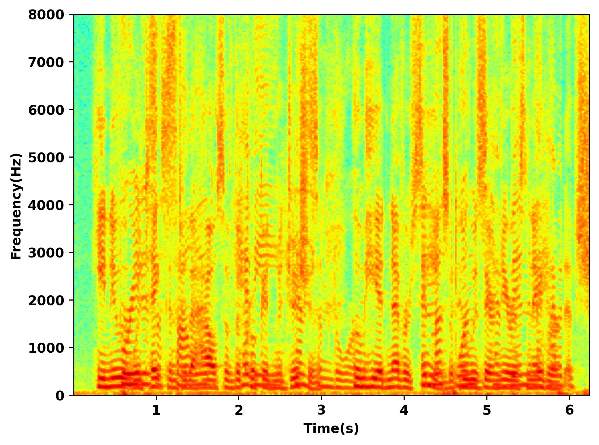</td>
                    <td style="vertical-align: middle; text-align: center; padding: 10px 5px 0 5px;">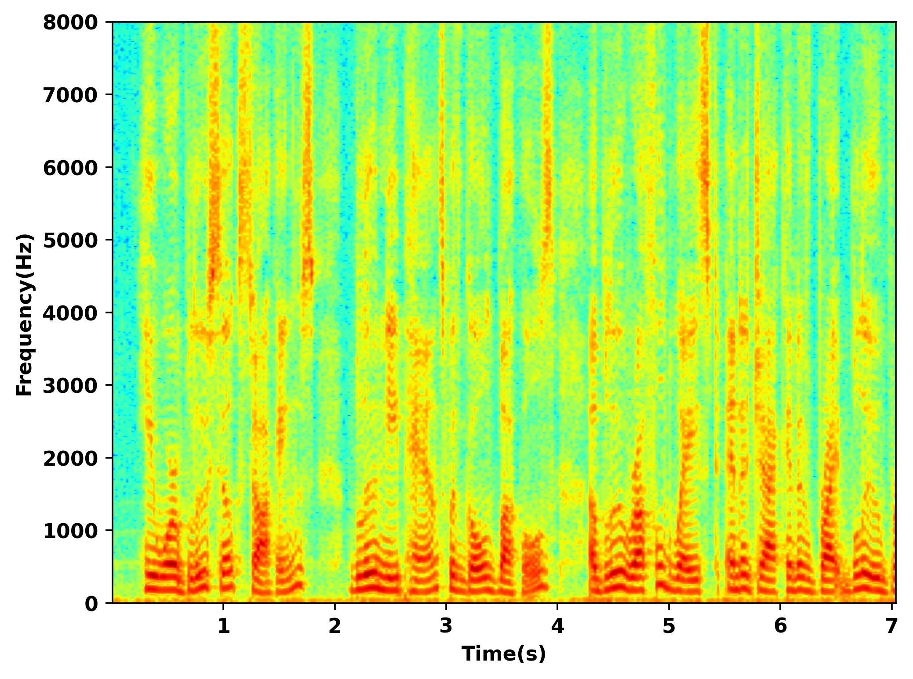</td>
                    <td style="vertical-align: middle; text-align: center; padding: 10px 5px 0 5px;">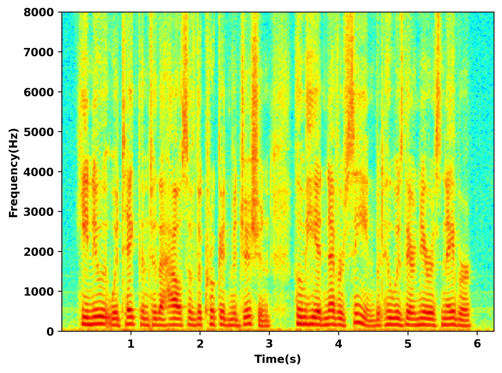</td>
                    <td style="vertical-align: middle; text-align: center; padding: 10px 5px 0 5px;">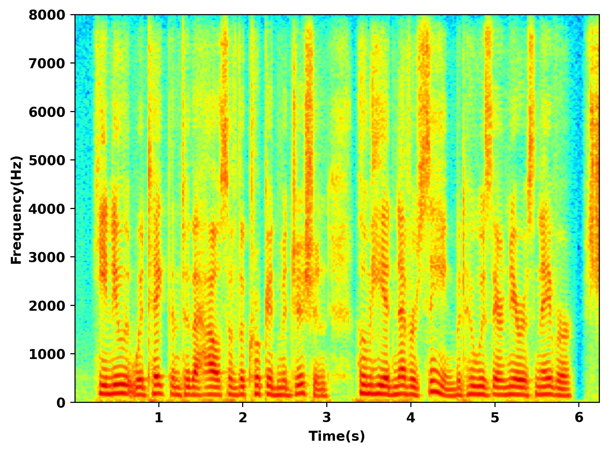</td>
                    <td style="vertical-align: middle; text-align: center; padding: 10px 5px 0 5px;">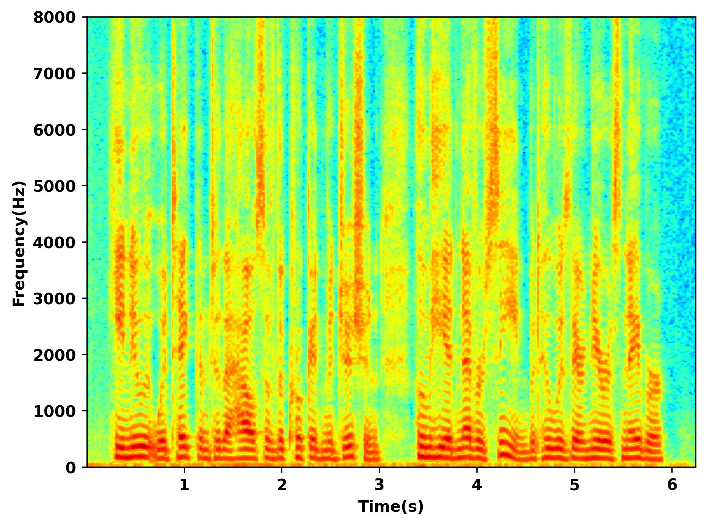</td>
                    <td style="vertical-align: middle; text-align: center; padding: 10px 5px 0 5px;">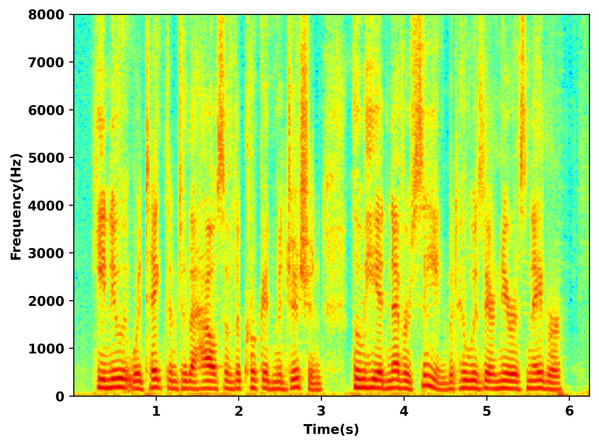</td>
                </tr>
                <tr>
                    <td style="vertical-align: middle; text-align: center; padding: 0 5px 10px 5px;"><audio controls style="width: 100%;"><source src="audio/Libri2Mix-Clean/FF/1284-1180-0007_2094-142345-0002/Mixture.wav" type="audio/wav"></audio></td>
                    <td style="vertical-align: middle; text-align: center; padding: 0 5px 10px 5px;"><audio controls style="width: 100%;"><source src="audio/Libri2Mix-Clean/FF/1284-1180-0007_2094-142345-0002/Enroll1.wav" type="audio/wav"></audio></td>
                    <td style="vertical-align: middle; text-align: center; padding: 0 5px 10px 5px;"><audio controls style="width: 100%;"><source src="audio/Libri2Mix-Clean/FF/1284-1180-0007_2094-142345-0002/S1_Clean.wav" type="audio/wav"></audio></td>
                    <td style="vertical-align: middle; text-align: center; padding: 0 5px 10px 5px;"><audio controls style="width: 100%;"><source src="audio/Libri2Mix-Clean/FF/1284-1180-0007_2094-142345-0002/S1_MaskGENet.wav" type="audio/wav"></audio></td>
                    <td style="vertical-align: middle; text-align: center; padding: 0 5px 10px 5px;"><audio controls style="width: 100%;"><source src="audio/Libri2Mix-Clean/FF/1284-1180-0007_2094-142345-0002/S1_CIENet256.wav" type="audio/wav"></audio></td>
                    <td style="vertical-align: middle; text-align: center; padding: 0 5px 10px 5px;"><audio controls style="width: 100%;"><source src="audio/Libri2Mix-Clean/FF/1284-1180-0007_2094-142345-0002/S1_Spex+.wav" type="audio/wav"></audio></td>
                </tr>
                <tr>
                    <td style="vertical-align: middle; text-align: center; padding: 10px 5px 0 5px;">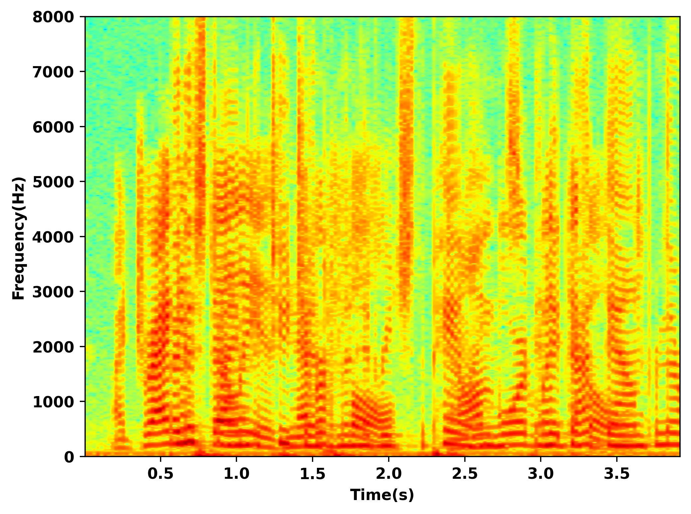</td>
                    <td style="vertical-align: middle; text-align: center; padding: 10px 5px 0 5px;">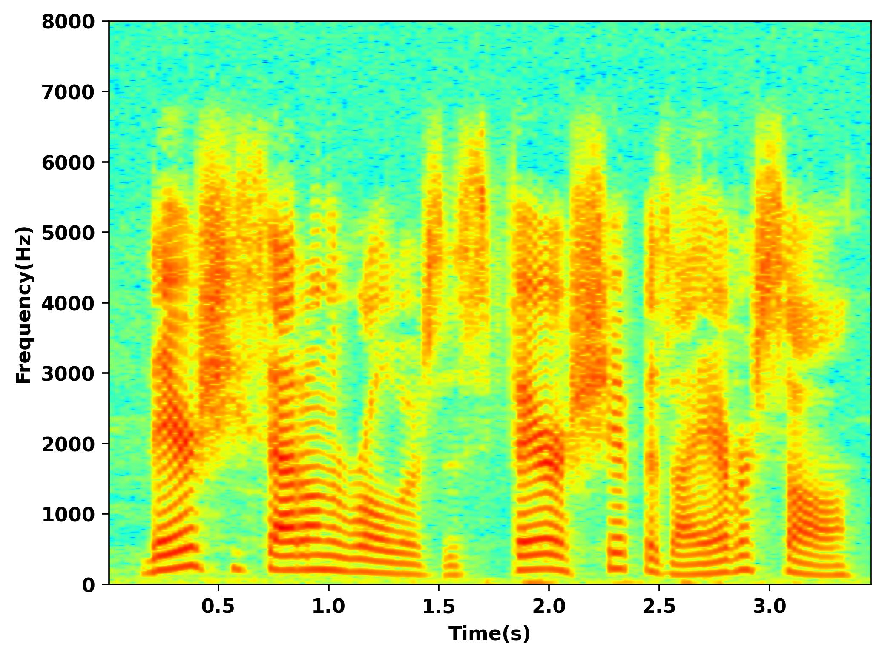</td>
                    <td style="vertical-align: middle; text-align: center; padding: 10px 5px 0 5px;">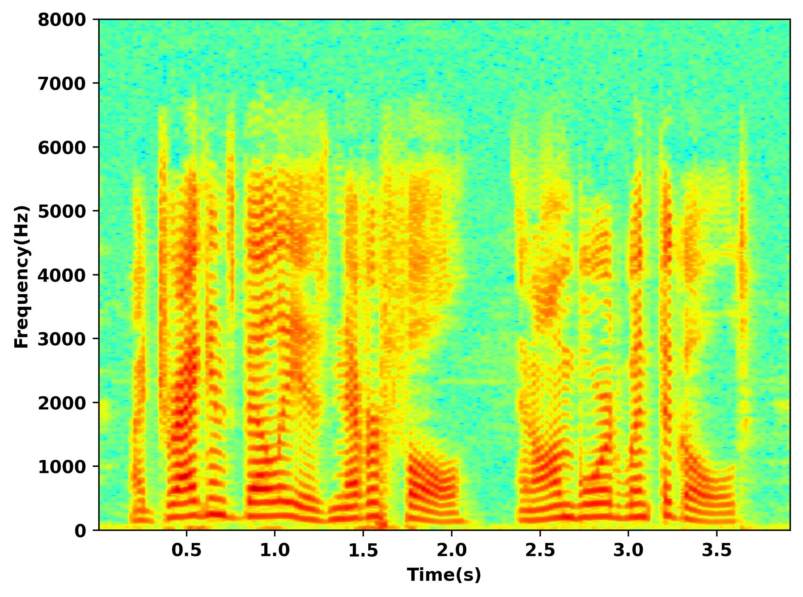</td>
                    <td style="vertical-align: middle; text-align: center; padding: 10px 5px 0 5px;">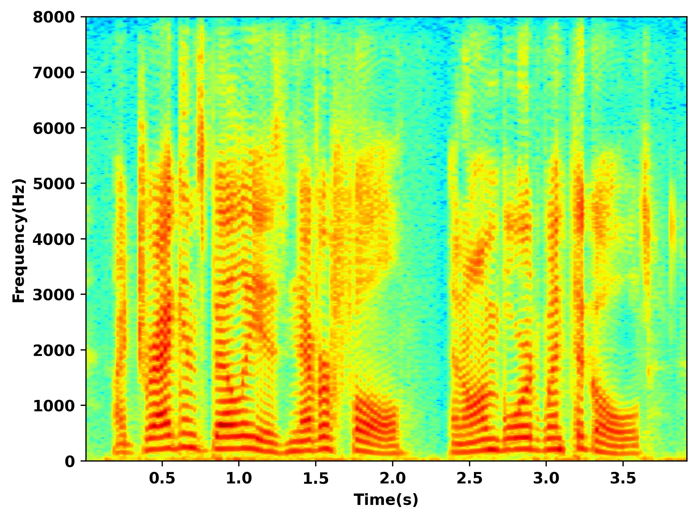</td>
                    <td style="vertical-align: middle; text-align: center; padding: 10px 5px 0 5px;">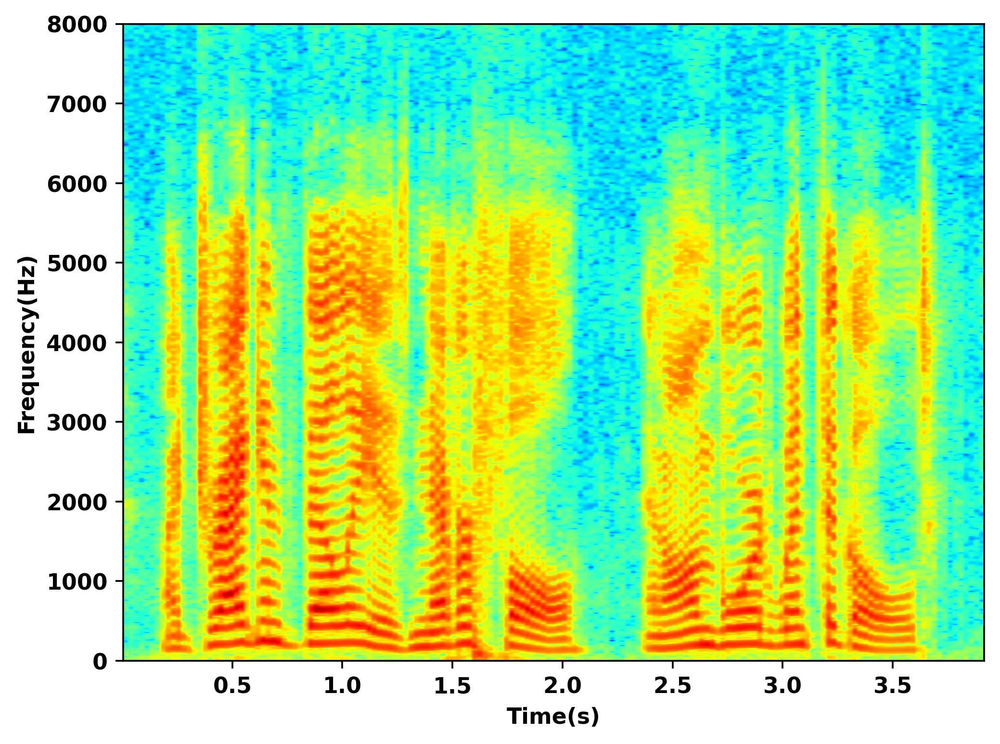</td>
                    <td style="vertical-align: middle; text-align: center; padding: 10px 5px 0 5px;">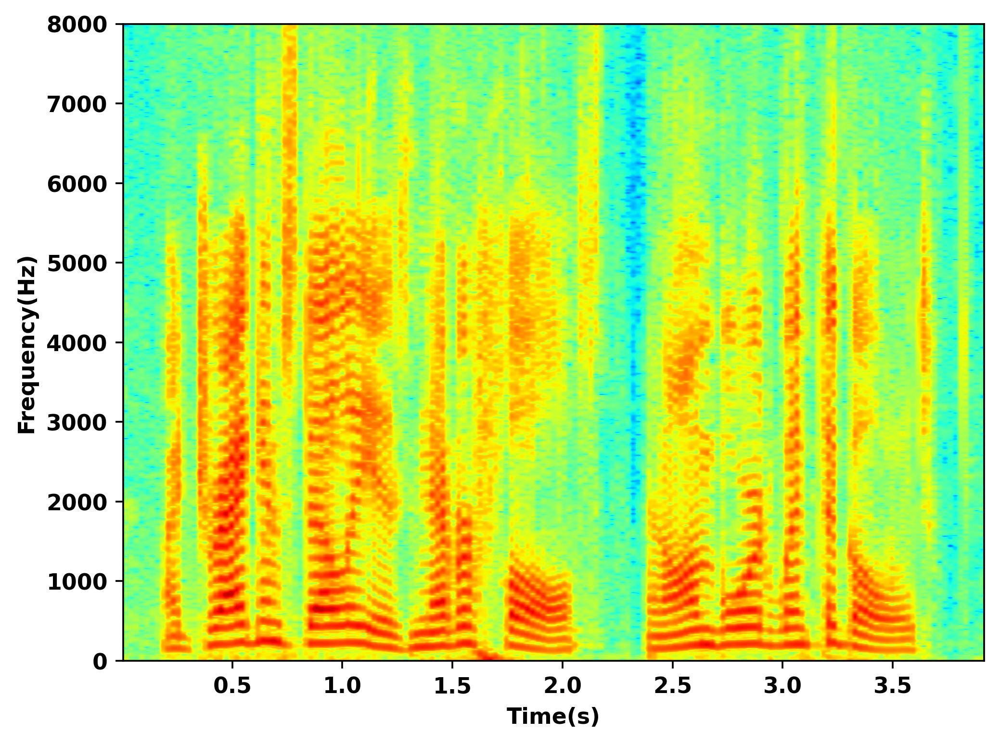</td>
                </tr>
                <tr>
                    <td style="vertical-align: middle; text-align: center; padding: 0 5px 10px 5px;"><audio controls style="width: 100%;"><source src="audio/Libri2Mix-Clean/FF/5142-33396-0018_2094-142345-0043/Mixture.wav" type="audio/wav"></audio></td>
                    <td style="vertical-align: middle; text-align: center; padding: 0 5px 10px 5px;"><audio controls style="width: 100%;"><source src="audio/Libri2Mix-Clean/FF/5142-33396-0018_2094-142345-0043/Enroll1.wav" type="audio/wav"></audio></td>
                    <td style="vertical-align: middle; text-align: center; padding: 0 5px 10px 5px;"><audio controls style="width: 100%;"><source src="audio/Libri2Mix-Clean/FF/5142-33396-0018_2094-142345-0043/S1_Clean.wav" type="audio/wav"></audio></td>
                    <td style="vertical-align: middle; text-align: center; padding: 0 5px 10px 5px;"><audio controls style="width: 100%;"><source src="audio/Libri2Mix-Clean/FF/5142-33396-0018_2094-142345-0043/S1_MaskGENet.wav" type="audio/wav"></audio></td>
                    <td style="vertical-align: middle; text-align: center; padding: 0 5px 10px 5px;"><audio controls style="width: 100%;"><source src="audio/Libri2Mix-Clean/FF/5142-33396-0018_2094-142345-0043/S1_CIENet256.wav" type="audio/wav"></audio></td>
                    <td style="vertical-align: middle; text-align: center; padding: 0 5px 10px 5px;"><audio controls style="width: 100%;"><source src="audio/Libri2Mix-Clean/FF/5142-33396-0018_2094-142345-0043/S1_SpEx+.wav" type="audio/wav"></audio></td>
                </tr>
                <tr>
                    <td style="vertical-align: middle; text-align: center;" rowspan="4">MF</td>
                    <td style="vertical-align: middle; text-align: center; padding: 10px 5px 0 5px;">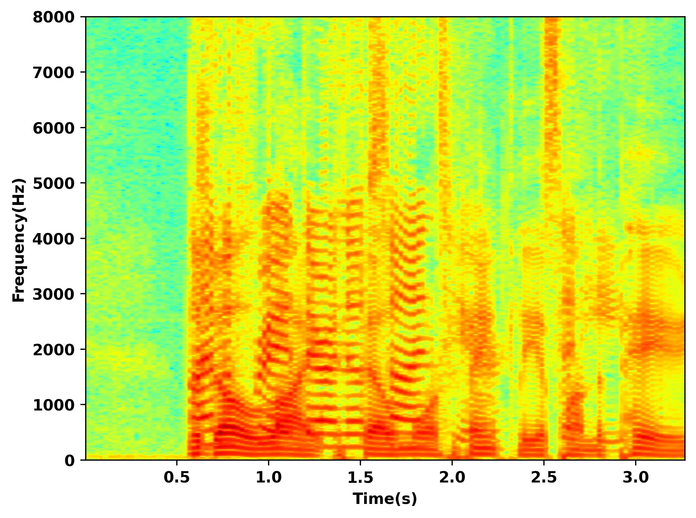</td>
                    <td style="vertical-align: middle; text-align: center; padding: 10px 5px 0 5px;">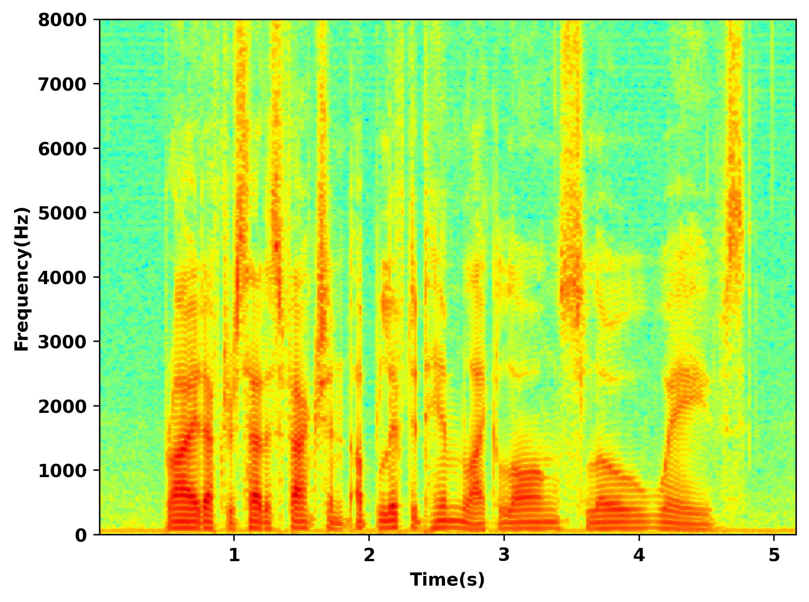</td>
                    <td style="vertical-align: middle; text-align: center; padding: 10px 5px 0 5px;">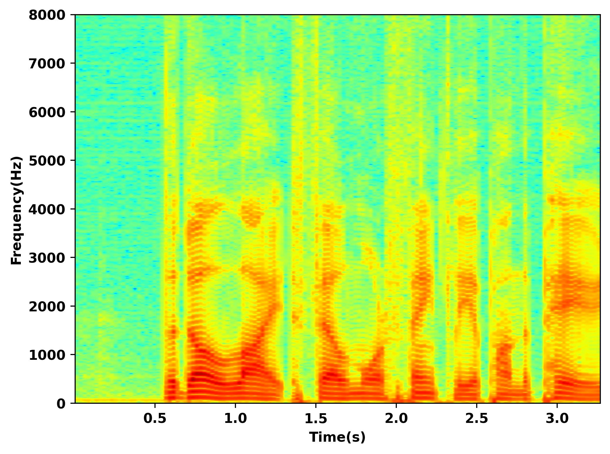</td>
                    <td style="vertical-align: middle; text-align: center; padding: 10px 5px 0 5px;">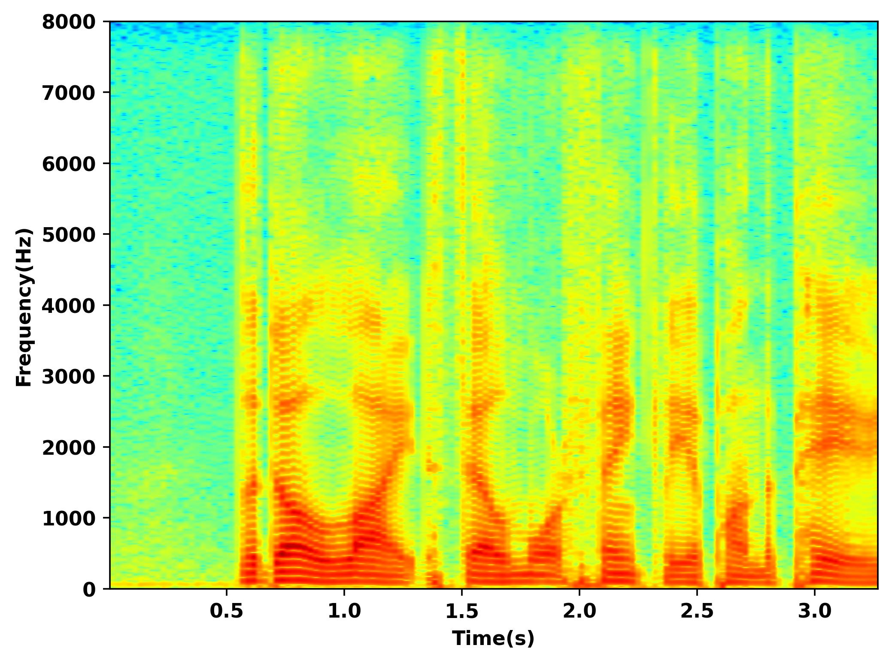</td>
                    <td style="vertical-align: middle; text-align: center; padding: 10px 5px 0 5px;">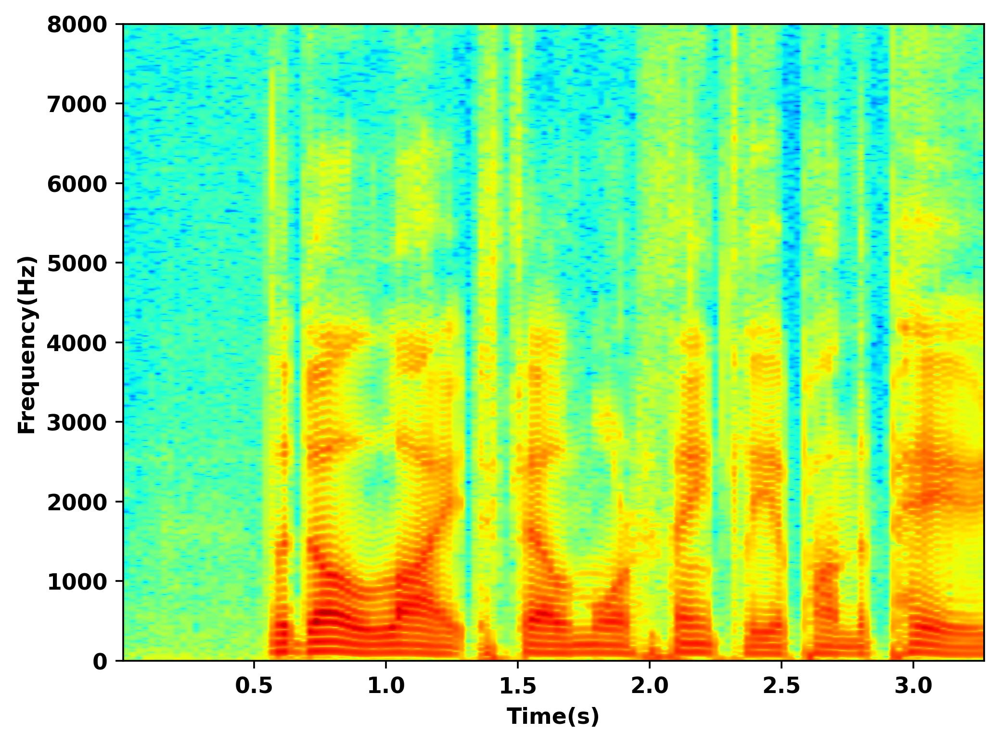</td>
                    <td style="vertical-align: middle; text-align: center; padding: 10px 5px 0 5px;">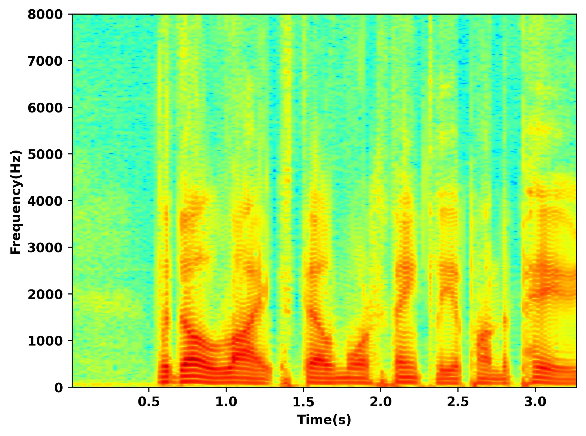</td>
                </tr>
                <tr>
                    <td style="vertical-align: middle; text-align: center; padding: 0 5px 10px 5px;"><audio controls style="width: 100%;"><source src="audio/Libri2Mix-Clean/MF/1089-134686-0006_1580-141083-002/Mixture.wav" type="audio/wav"></audio></td>
                    <td style="vertical-align: middle; text-align: center; padding: 0 5px 10px 5px;"><audio controls style="width: 100%;"><source src="audio/Libri2Mix-Clean/MF/1089-134686-0006_1580-141083-002/Enroll1.wav" type="audio/wav"></audio></td>
                    <td style="vertical-align: middle; text-align: center; padding: 0 5px 10px 5px;"><audio controls style="width: 100%;"><source src="audio/Libri2Mix-Clean/MF/1089-134686-0006_1580-141083-002/S1_Clean.wav" type="audio/wav"></audio></td>
                    <td style="vertical-align: middle; text-align: center; padding: 0 5px 10px 5px;"><audio controls style="width: 100%;"><source src="audio/Libri2Mix-Clean/MF/1089-134686-0006_1580-141083-002/S1_MaskGENet.wav" type="audio/wav"></audio></td>
                    <td style="vertical-align: middle; text-align: center; padding: 0 5px 10px 5px;"><audio controls style="width: 100%;"><source src="audio/Libri2Mix-Clean/MF/1089-134686-0006_1580-141083-002/S1_CIENet256.wav" type="audio/wav"></audio></td>
                    <td style="vertical-align: middle; text-align: center; padding: 0 5px 10px 5px;"><audio controls style="width: 100%;"><source src="audio/Libri2Mix-Clean/MF/1089-134686-0006_1580-141083-002/S1_SpEx+.wav" type="audio/wav"></audio></td>
                </tr>
                <tr>
                    <td style="vertical-align: middle; text-align: center; padding: 10px 5px 0 5px;">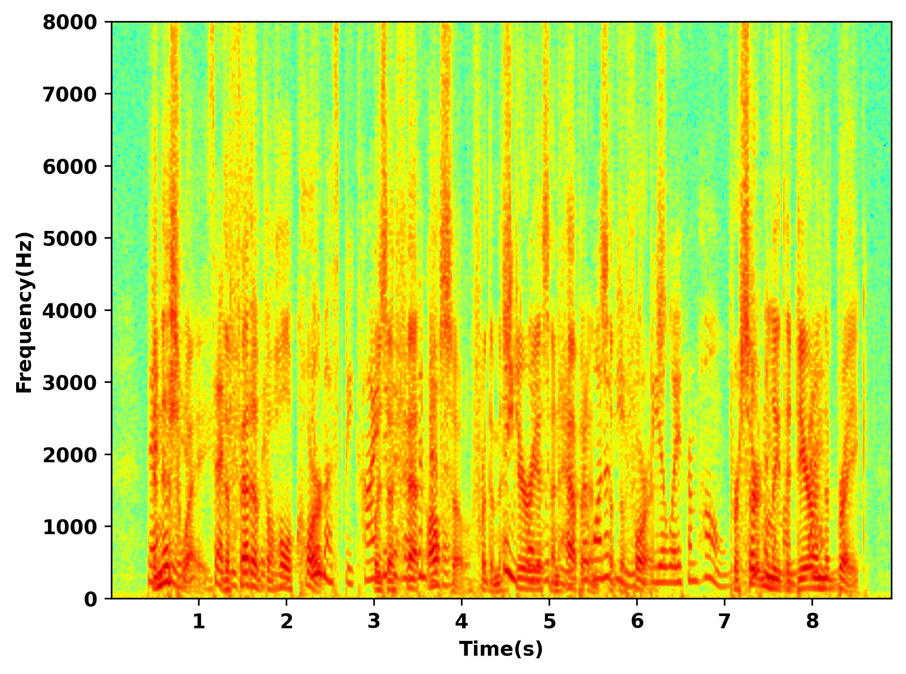</td>
                    <td style="vertical-align: middle; text-align: center; padding: 10px 5px 0 5px;">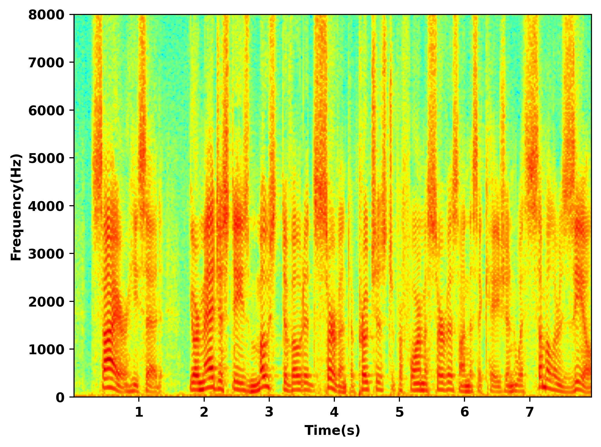</td>
                    <td style="vertical-align: middle; text-align: center; padding: 10px 5px 0 5px;">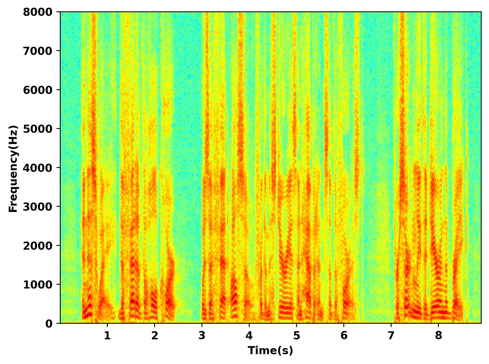</td>
                    <td style="vertical-align: middle; text-align: center; padding: 10px 5px 0 5px;">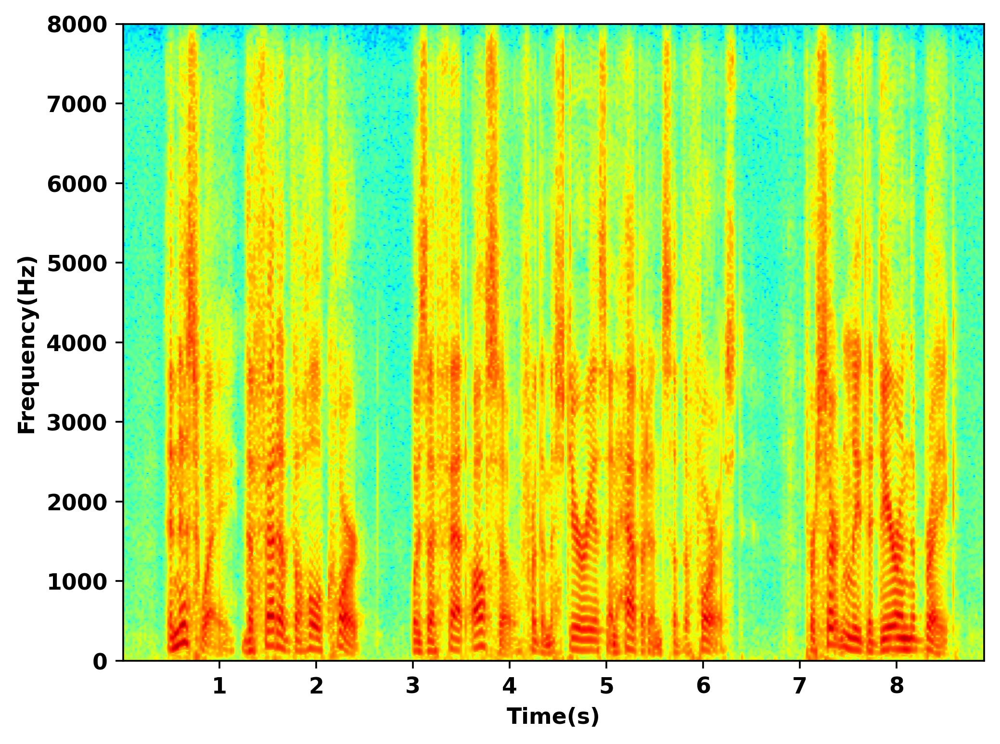</td>
                    <td style="vertical-align: middle; text-align: center; padding: 10px 5px 0 5px;">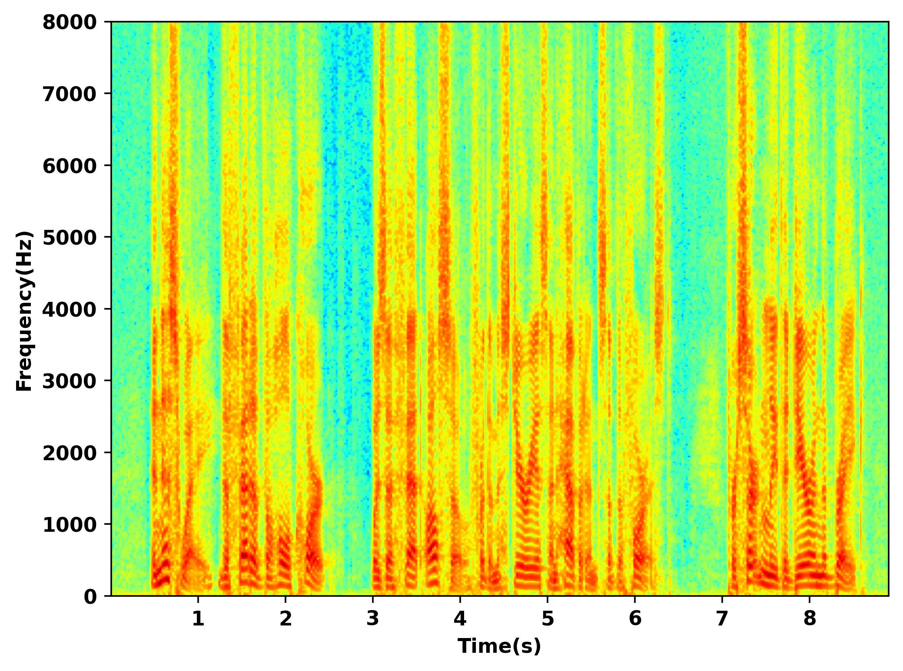</td>
                    <td style="vertical-align: middle; text-align: center; padding: 10px 5px 0 5px;">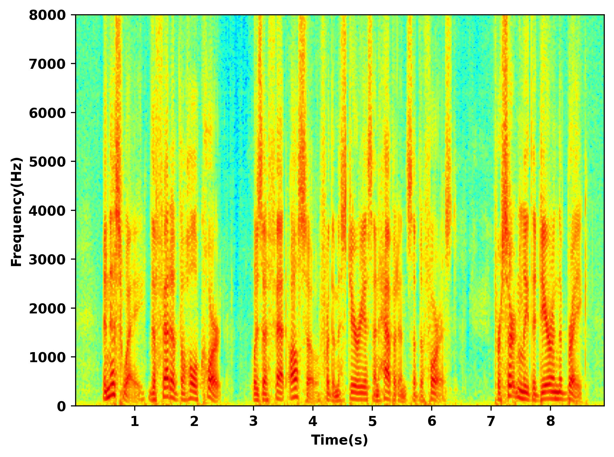</td>
                </tr>
                <tr>
                    <td style="vertical-align: middle; text-align: center; padding: 0 5px 10px 5px;"><audio controls style="width: 100%;"><source src="audio/Libri2Mix-Clean/MF/7127-75947-0040_237-126133-0002/Mixture.wav" type="audio/wav"></audio></td>
                    <td style="vertical-align: middle; text-align: center; padding: 0 5px 10px 5px;"><audio controls style="width: 100%;"><source src="audio/Libri2Mix-Clean/MF/7127-75947-0040_237-126133-0002/Enroll1.wav" type="audio/wav"></audio></td>
                    <td style="vertical-align: middle; text-align: center; padding: 0 5px 10px 5px;"><audio controls style="width: 100%;"><source src="audio/Libri2Mix-Clean/MF/7127-75947-0040_237-126133-0002/S1_Clean.wav" type="audio/wav"></audio></td>
                    <td style="vertical-align: middle; text-align: center; padding: 0 5px 10px 5px;"><audio controls style="width: 100%;"><source src="audio/Libri2Mix-Clean/MF/7127-75947-0040_237-126133-0002/S1_MaskGENet.wav" type="audio/wav"></audio></td>
                    <td style="vertical-align: middle; text-align: center; padding: 0 5px 10px 5px;"><audio controls style="width: 100%;"><source src="audio/Libri2Mix-Clean/MF/7127-75947-0040_237-126133-0002/S1_CIENet256.wav" type="audio/wav"></audio></td>
                    <td style="vertical-align: middle; text-align: center; padding: 0 5px 10px 5px;"><audio controls style="width: 100%;"><source src="audio/Libri2Mix-Clean/MF/7127-75947-0040_237-126133-0002/S1_SpEx+.wav" type="audio/wav"></audio></td>
                </tr>
                <tr>
                    <td style="vertical-align: middle; text-align: center;" rowspan="4">MM</td>
                    <td style="vertical-align: middle; text-align: center; padding: 10px 5px 0 5px;">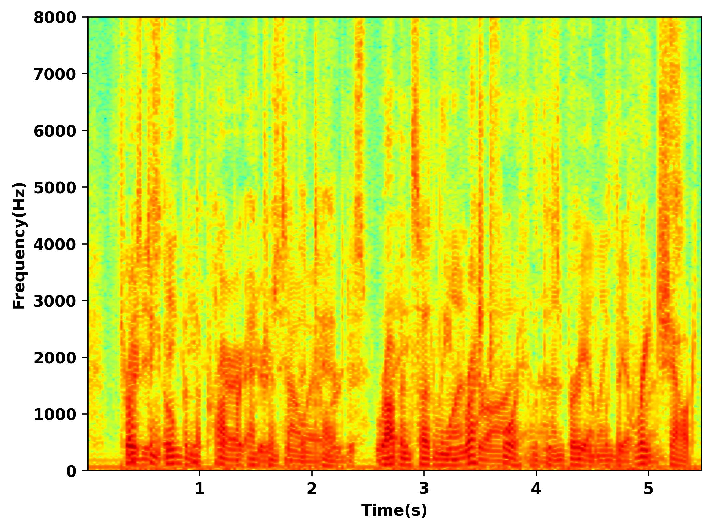</td>
                    <td style="vertical-align: middle; text-align: center; padding: 10px 5px 0 5px;">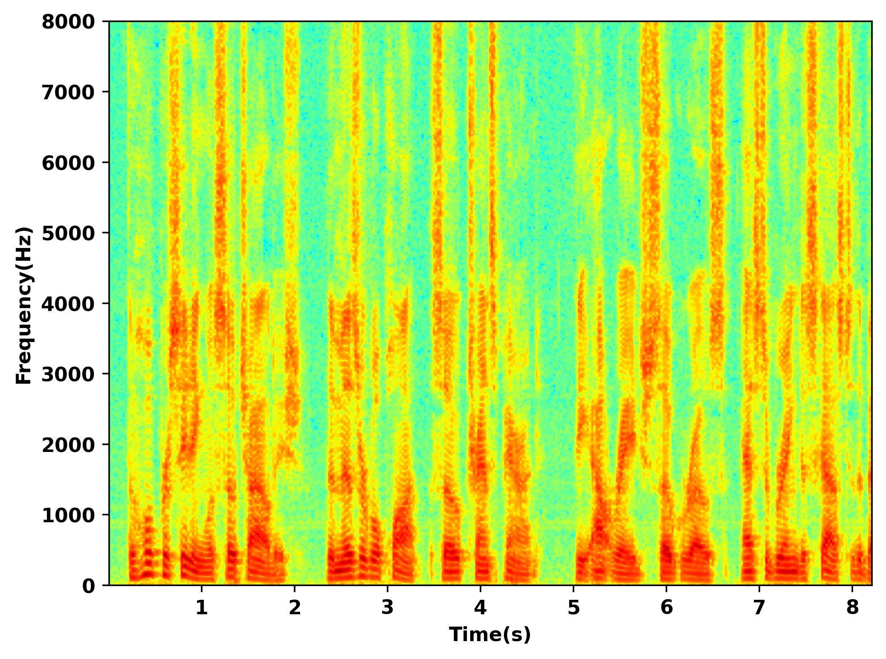</td>
                    <td style="vertical-align: middle; text-align: center; padding: 10px 5px 0 5px;">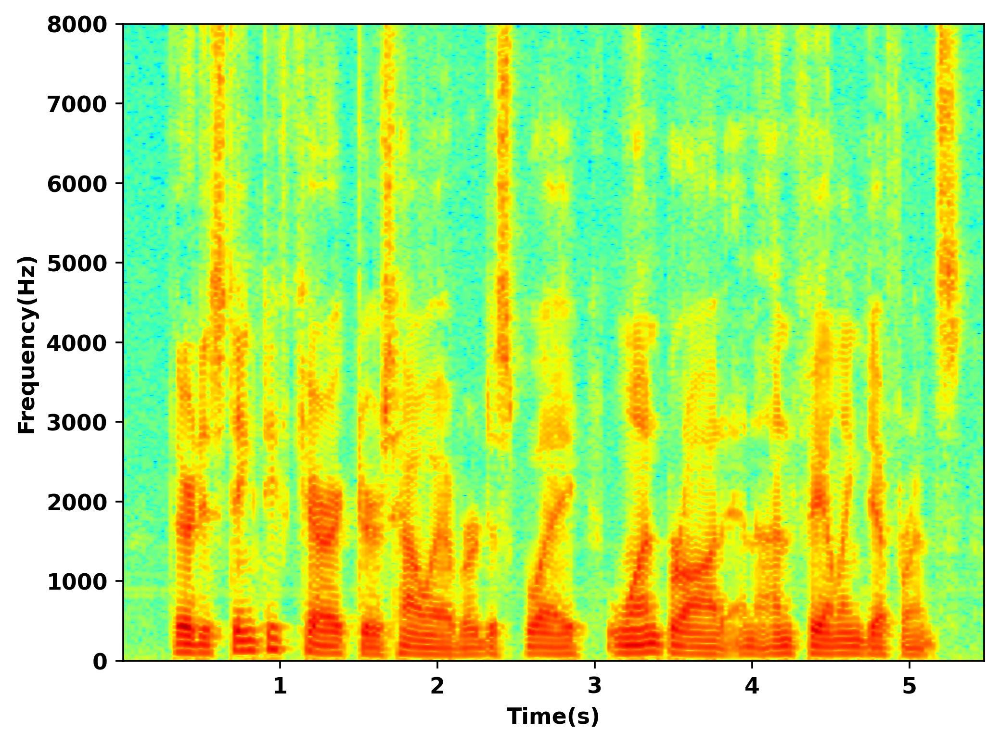</td>
                    <td style="vertical-align: middle; text-align: center; padding: 10px 5px 0 5px;">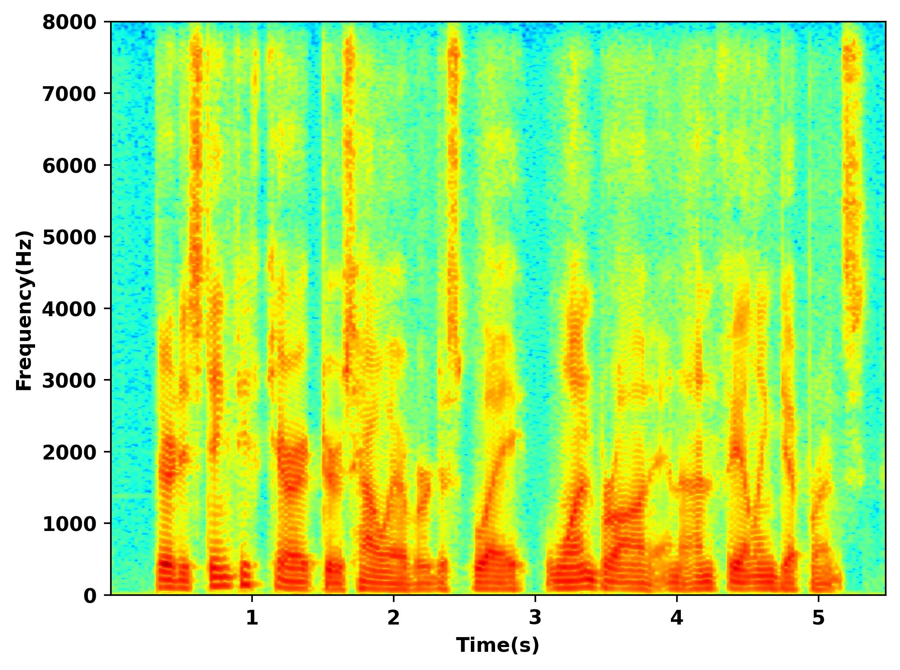</td>
                    <td style="vertical-align: middle; text-align: center; padding: 10px 5px 0 5px;">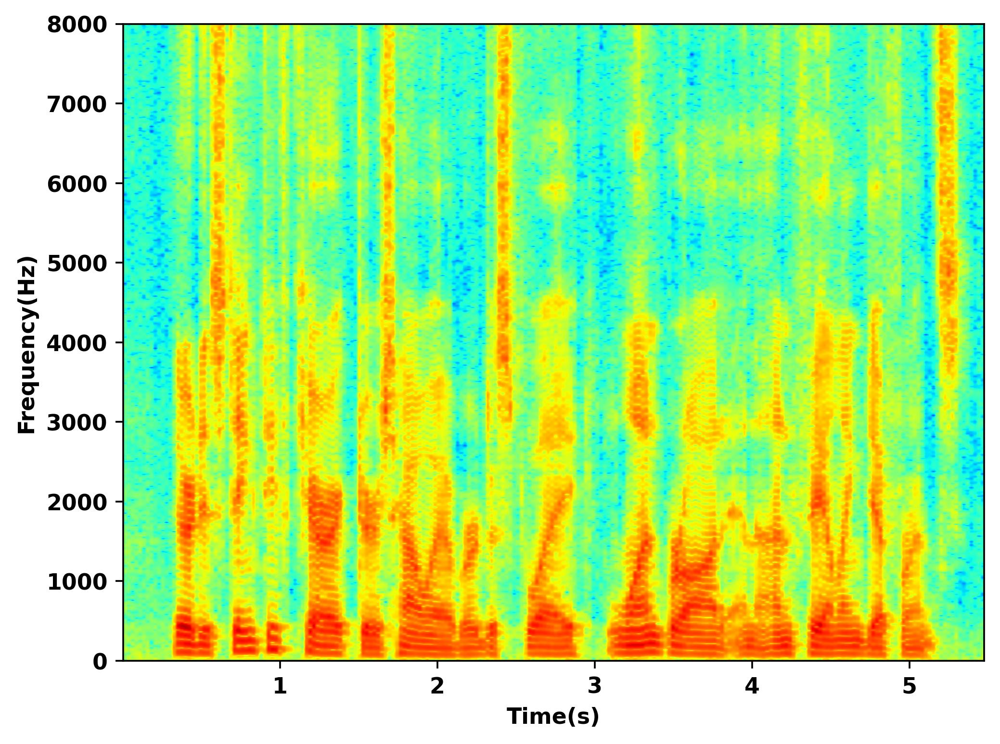</td>
                    <td style="vertical-align: middle; text-align: center; padding: 10px 5px 0 5px;">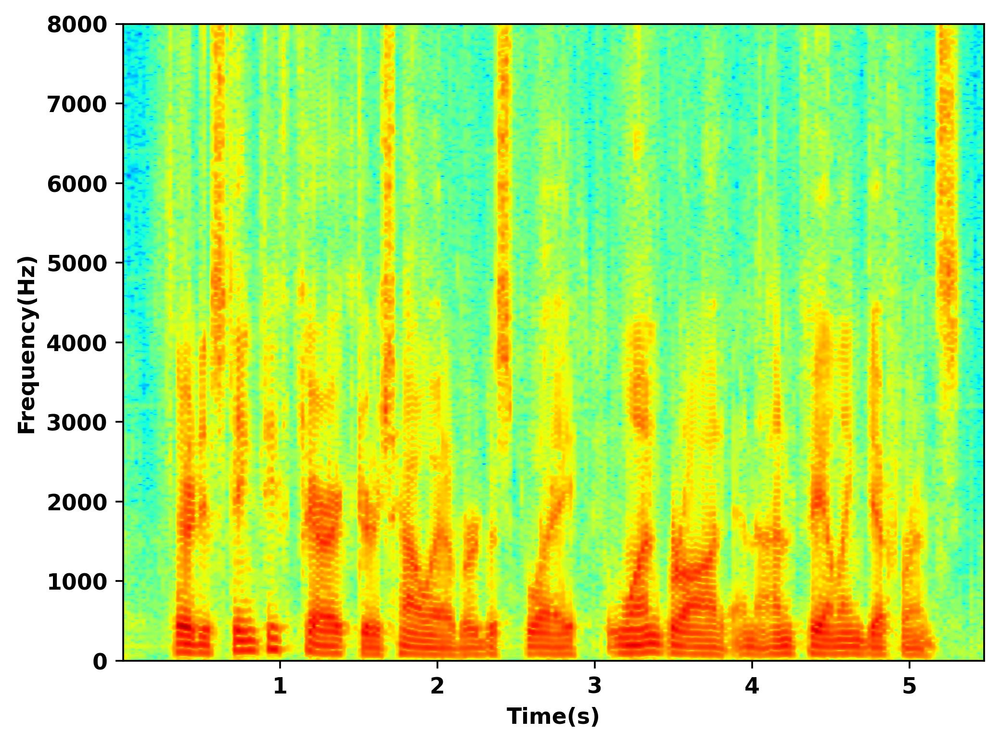</td>
                </tr>
                <tr>
                    <td style="vertical-align: middle; text-align: center; padding: 0 5px 10px 5px;"><audio controls style="width: 100%;"><source src="audio/Libri2Mix-Clean/MM/7729-102255-0023_61-70968-0033/Mixture.wav" type="audio/wav"></audio></td>
                    <td style="vertical-align: middle; text-align: center; padding: 0 5px 10px 5px;"><audio controls style="width: 100%;"><source src="audio/Libri2Mix-Clean/MM/7729-102255-0023_61-70968-0033/Enroll1.wav" type="audio/wav"></audio></td>
                    <td style="vertical-align: middle; text-align: center; padding: 0 5px 10px 5px;"><audio controls style="width: 100%;"><source src="audio/Libri2Mix-Clean/MM/7729-102255-0023_61-70968-0033/S1_Clean.wav" type="audio/wav"></audio></td>
                    <td style="vertical-align: middle; text-align: center; padding: 0 5px 10px 5px;"><audio controls style="width: 100%;"><source src="audio/Libri2Mix-Clean/MM/7729-102255-0023_61-70968-0033/S1_MaskGENet.wav" type="audio/wav"></audio></td>
                    <td style="vertical-align: middle; text-align: center; padding: 0 5px 10px 5px;"><audio controls style="width: 100%;"><source src="audio/Libri2Mix-Clean/MM/7729-102255-0023_61-70968-0033/S1_CIENet256.wav" type="audio/wav"></audio></td>
                    <td style="vertical-align: middle; text-align: center; padding: 0 5px 10px 5px;"><audio controls style="width: 100%;"><source src="audio/Libri2Mix-Clean/MM/7729-102255-0023_61-70968-0033/S1_SpEx+.wav" type="audio/wav"></audio></td>
                </tr>
                <tr>
                    <td style="vertical-align: middle; text-align: center; padding: 10px 5px 0 5px;">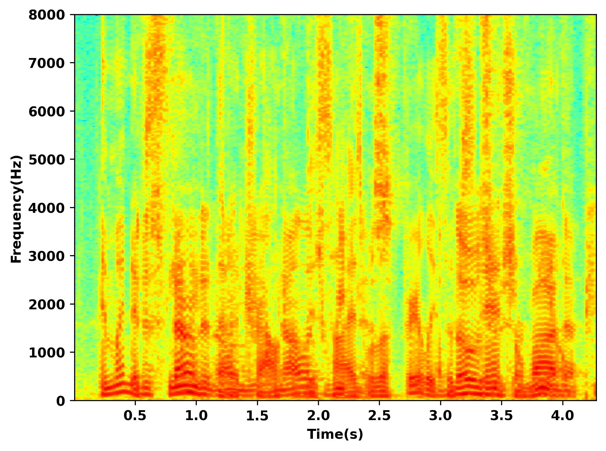</td>
                    <td style="vertical-align: middle; text-align: center; padding: 10px 5px 0 5px;">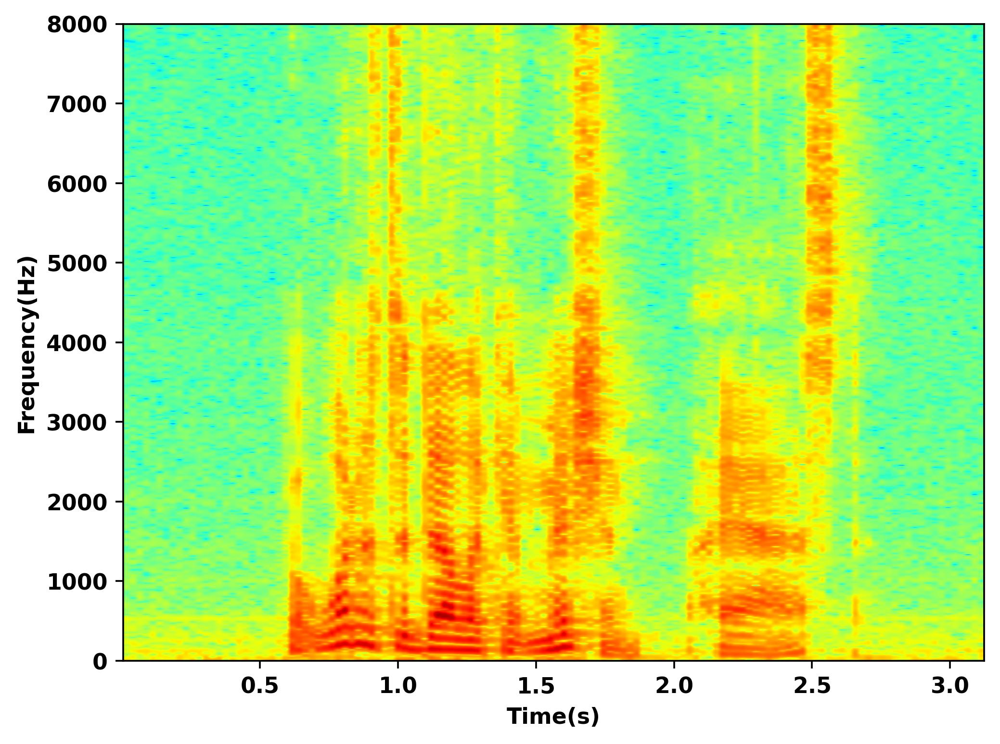</td>
                    <td style="vertical-align: middle; text-align: center; padding: 10px 5px 0 5px;">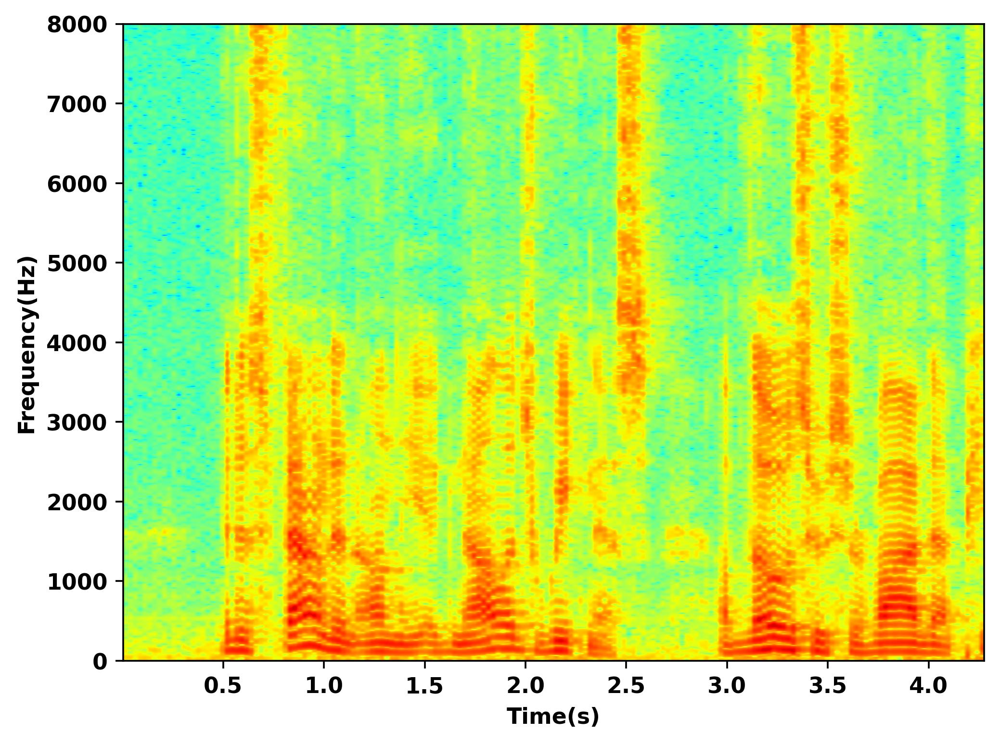</td>
                    <td style="vertical-align: middle; text-align: center; padding: 10px 5px 0 5px;">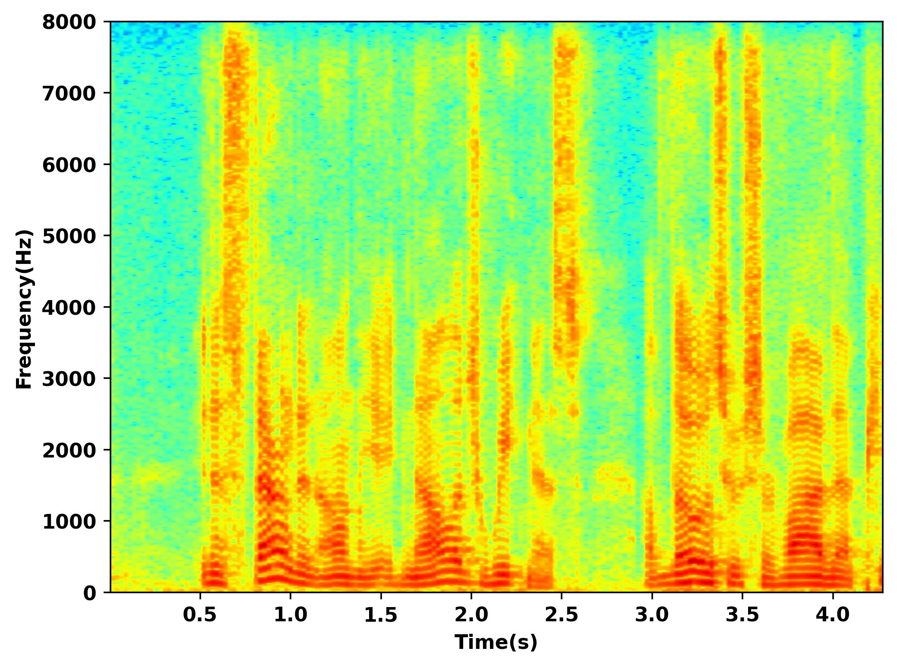</td>
                    <td style="vertical-align: middle; text-align: center; padding: 10px 5px 0 5px;">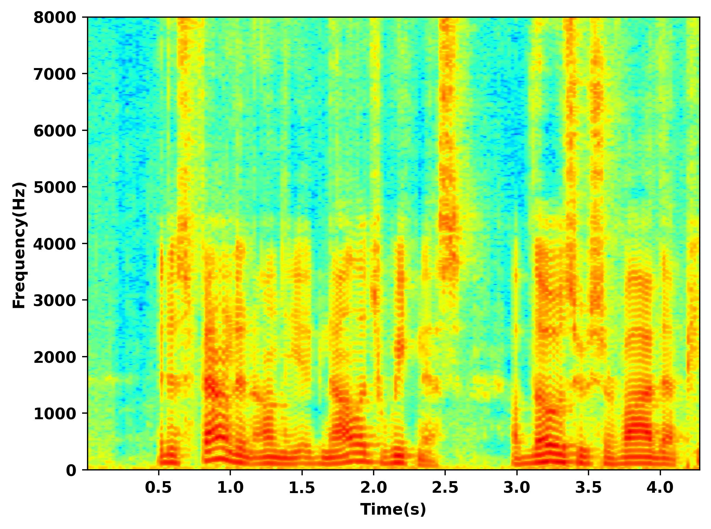</td>
                    <td style="vertical-align: middle; text-align: center; padding: 10px 5px 0 5px;">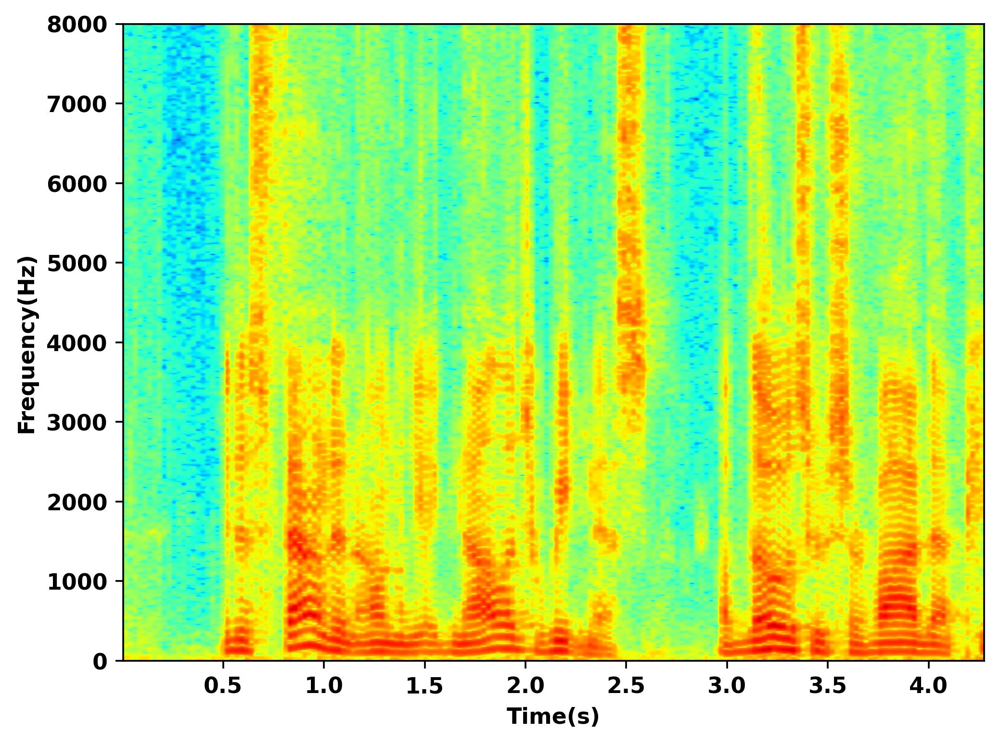</td>
                </tr>
                <tr>
                    <td style="vertical-align: middle; text-align: center; padding: 0 5px 10px 5px;"><audio controls style="width: 100%;"><source src="audio/Libri2Mix-Clean/MM/8455-210777-0058_7176-88083-0006/Mixture.wav" type="audio/wav"></audio></td>
                    <td style="vertical-align: middle; text-align: center; padding: 0 5px 10px 5px;"><audio controls style="width: 100%;"><source src="audio/Libri2Mix-Clean/MM/8455-210777-0058_7176-88083-0006/Enroll1.wav" type="audio/wav"></audio></td>
                    <td style="vertical-align: middle; text-align: center; padding: 0 5px 10px 5px;"><audio controls style="width: 100%;"><source src="audio/Libri2Mix-Clean/MM/8455-210777-0058_7176-88083-0006/S1_Clean.wav" type="audio/wav"></audio></td>
                    <td style="vertical-align: middle; text-align: center; padding: 0 5px 10px 5px;"><audio controls style="width: 100%;"><source src="audio/Libri2Mix-Clean/MM/8455-210777-0058_7176-88083-0006/S1_MaskGENet.wav" type="audio/wav"></audio></td>
                    <td style="vertical-align: middle; text-align: center; padding: 0 5px 10px 5px;"><audio controls style="width: 100%;"><source src="audio/Libri2Mix-Clean/MM/8455-210777-0058_7176-88083-0006/S1_CIENet256.wav" type="audio/wav"></audio></td>
                    <td style="vertical-align: middle; text-align: center; padding: 0 5px 10px 5px;"><audio controls style="width: 100%;"><source src="audio/Libri2Mix-Clean/MM/8455-210777-0058_7176-88083-0006/S1_SpEx+.wav" type="audio/wav"></audio></td>
                </tr>
                <tr>
                    <td style="vertical-align: middle; text-align: center;" rowspan="8"><b>Noisy</b></td>
                    <td style="vertical-align: middle; text-align: center;" rowspan="2">FF</td>
                    <td style="vertical-align: middle; text-align: center; padding: 10px 5px 0 5px;">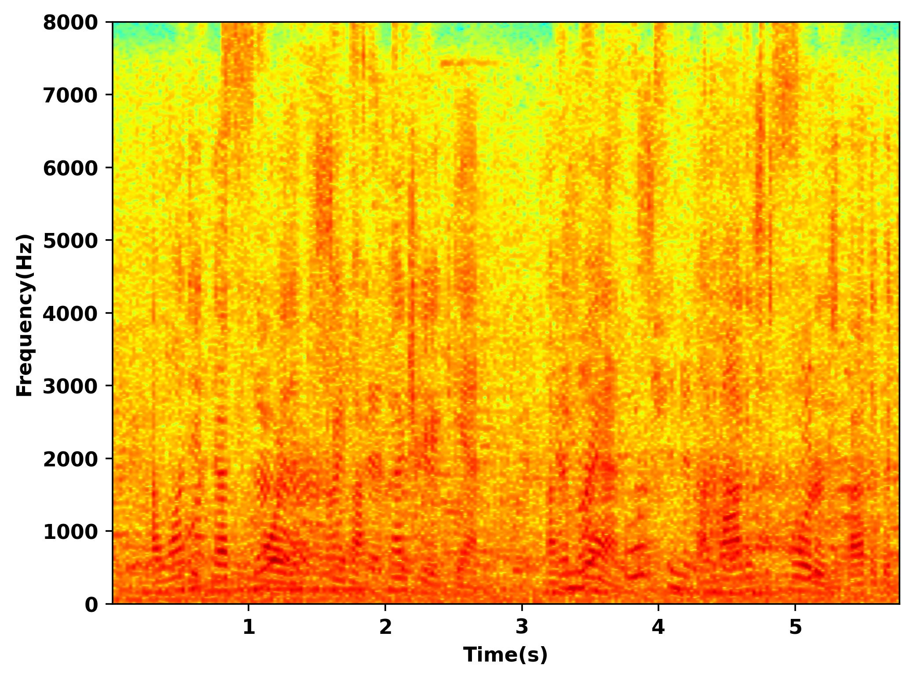</td>
                    <td style="vertical-align: middle; text-align: center; padding: 10px 5px 0 5px;">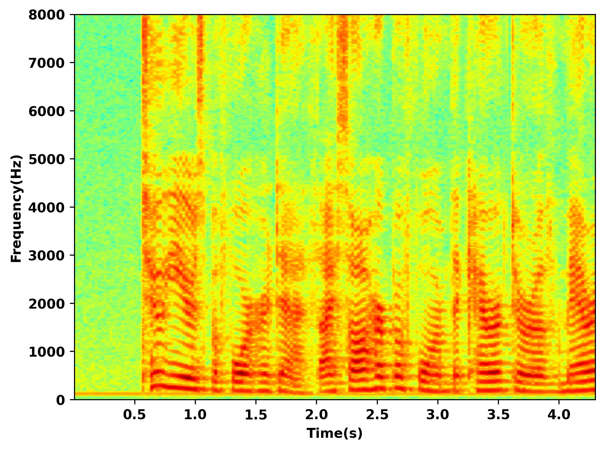</td>
                    <td style="vertical-align: middle; text-align: center; padding: 10px 5px 0 5px;">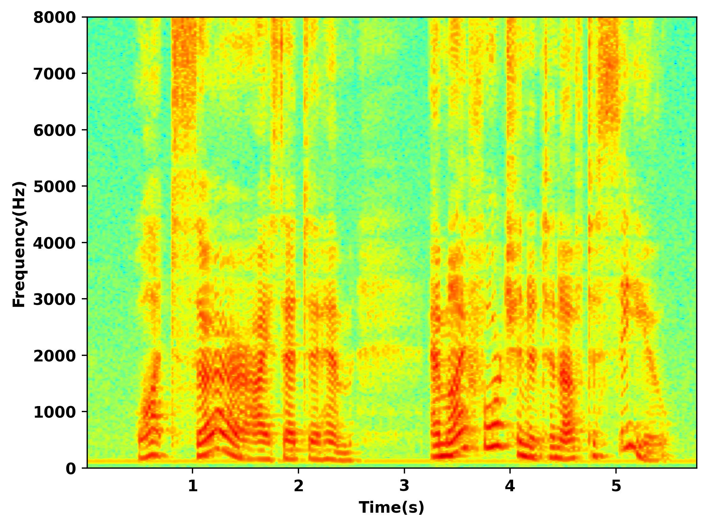</td>
                    <td style="vertical-align: middle; text-align: center; padding: 10px 5px 0 5px;">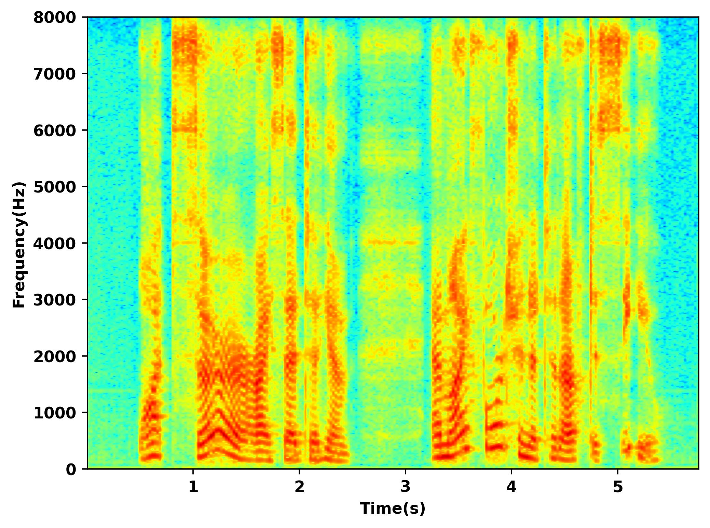</td>
                    <td style="vertical-align: middle; text-align: center; padding: 10px 5px 0 5px;">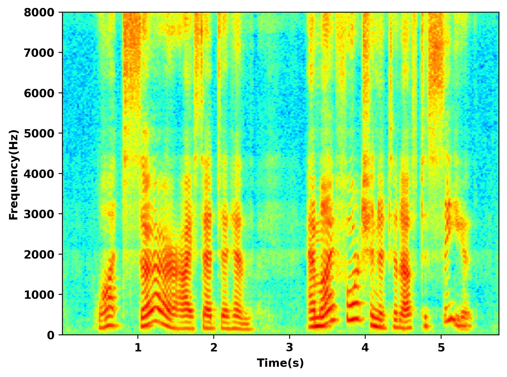</td>
                    <td style="vertical-align: middle; text-align: center; padding: 10px 5px 0 5px;">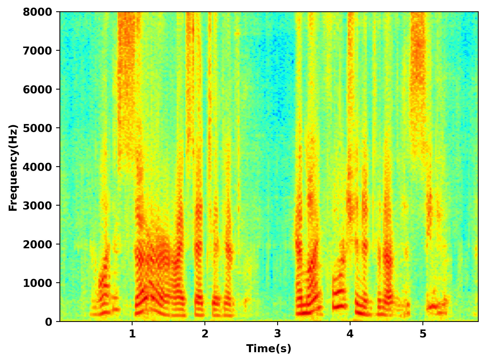</td>
                </tr>
                <tr>
                    <td style="vertical-align: middle; text-align: center; padding: 0 5px 10px 5px;"><audio controls style="width: 100%;"><source src="audio/Libri2Mix-Noisy/FF/3729-6852-0038_8463-294828-0003/Mixture.wav" type="audio/wav"></audio></td>
                    <td style="vertical-align: middle; text-align: center; padding: 0 5px 10px 5px;"><audio controls style="width: 100%;"><source src="audio/Libri2Mix-Noisy/FF/3729-6852-0038_8463-294828-0003/Enroll1.wav" type="audio/wav"></audio></td>
                    <td style="vertical-align: middle; text-align: center; padding: 0 5px 10px 5px;"><audio controls style="width: 100%;"><source src="audio/Libri2Mix-Noisy/FF/3729-6852-0038_8463-294828-0003/S1_Clean.wav" type="audio/wav"></audio></td>
                    <td style="vertical-align: middle; text-align: center; padding: 0 5px 10px 5px;"><audio controls style="width: 100%;"><source src="audio/Libri2Mix-Noisy/FF/3729-6852-0038_8463-294828-0003/S1_MaskGENet.wav" type="audio/wav"></audio></td>
                    <td style="vertical-align: middle; text-align: center; padding: 0 5px 10px 5px;"><audio controls style="width: 100%;"><source src="audio/Libri2Mix-Noisy/FF/3729-6852-0038_8463-294828-0003/S1_CIENet256.wav" type="audio/wav"></audio></td>
                    <td style="vertical-align: middle; text-align: center; padding: 0 5px 10px 5px;"><audio controls style="width: 100%;"><source src="audio/Libri2Mix-Noisy/FF/3729-6852-0038_8463-294828-0003/S1_SpEx+.wav" type="audio/wav"></audio></td>
                </tr>
                <tr>
                    <td style="vertical-align: middle; text-align: center;" rowspan="2">MF</td>
                    <td style="vertical-align: middle; text-align: center; padding: 10px 5px 0 5px;">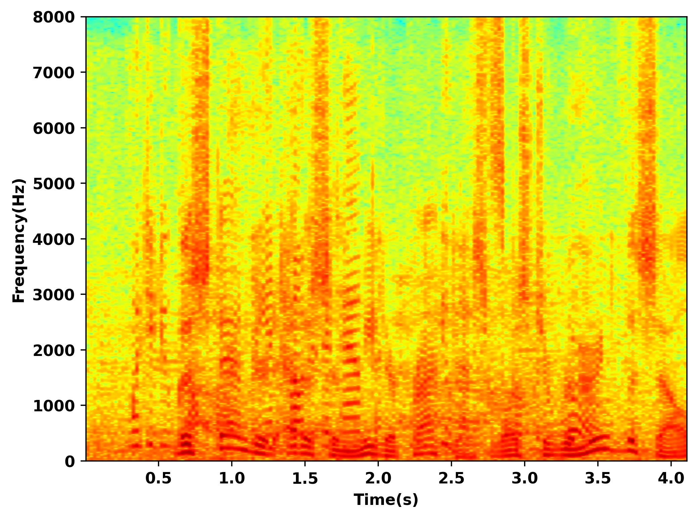</td>
                    <td style="vertical-align: middle; text-align: center; padding: 10px 5px 0 5px;">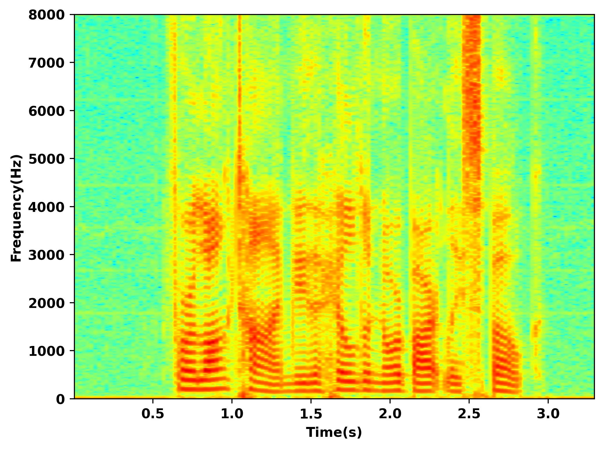</td>
                    <td style="vertical-align: middle; text-align: center; padding: 10px 5px 0 5px;">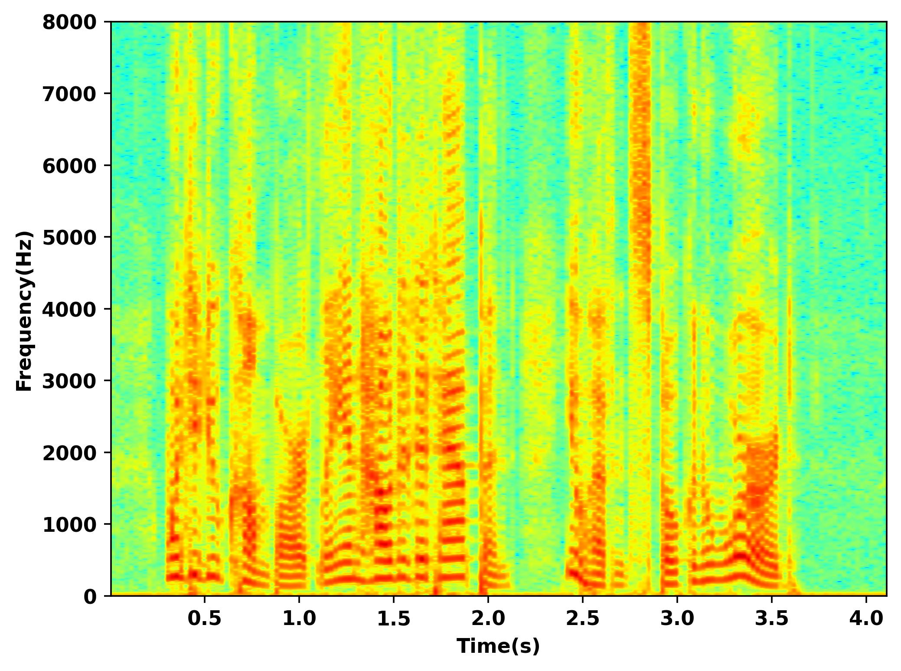</td>
                    <td style="vertical-align: middle; text-align: center; padding: 10px 5px 0 5px;">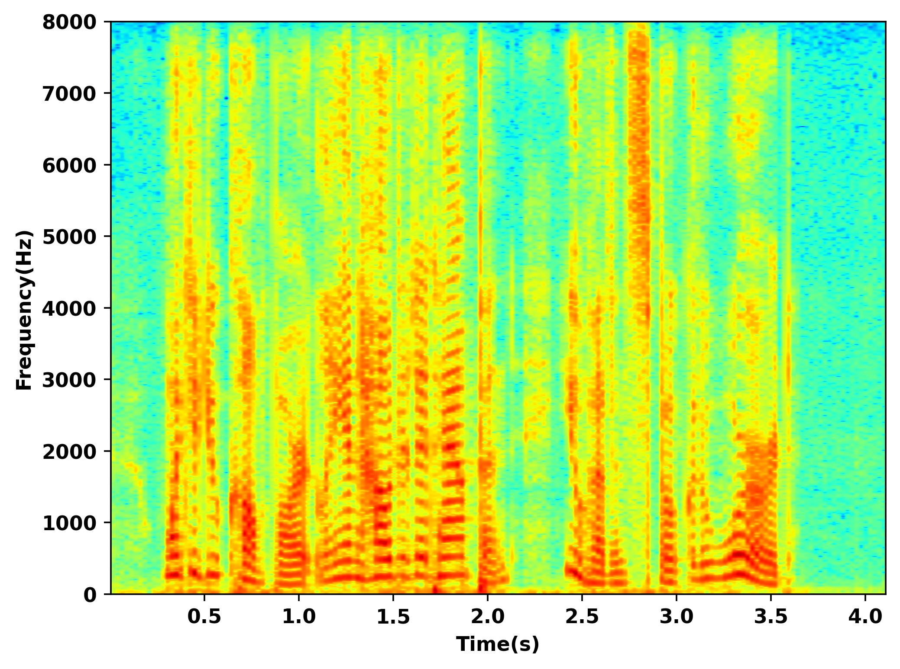</td>
                    <td style="vertical-align: middle; text-align: center; padding: 10px 5px 0 5px;">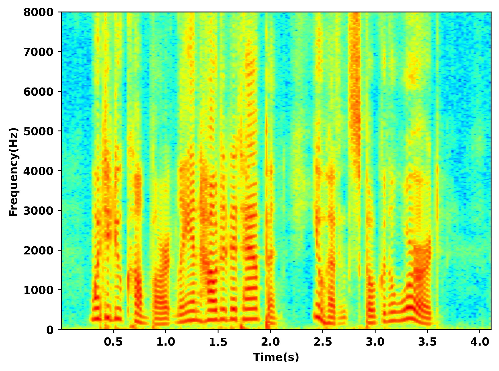</td>
                    <td style="vertical-align: middle; text-align: center; padding: 10px 5px 0 5px;">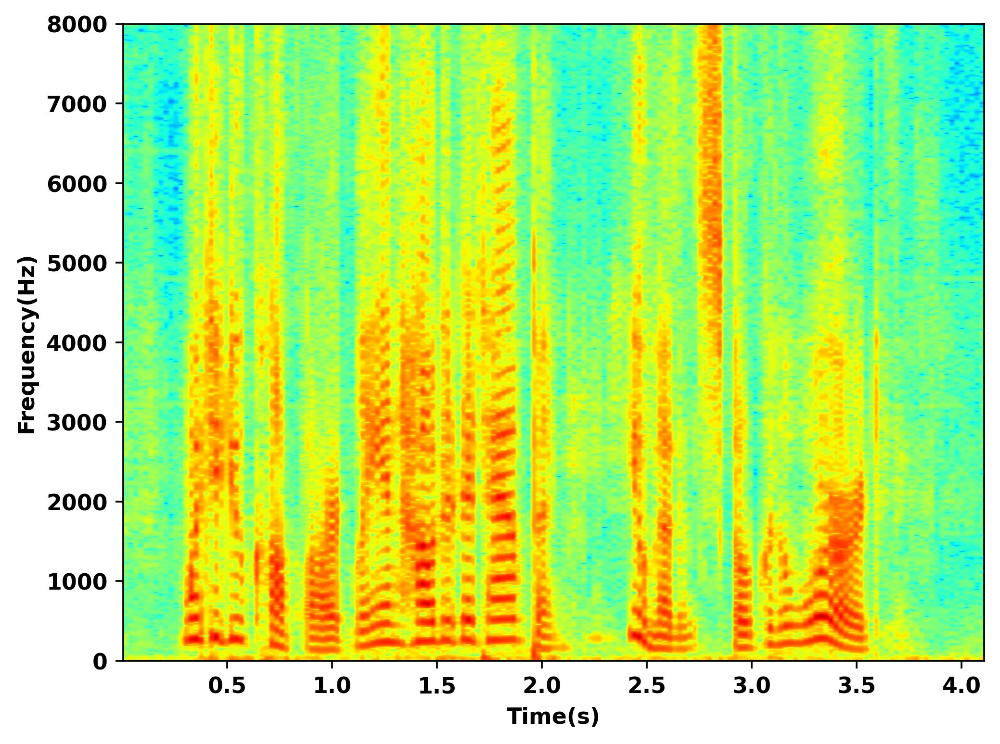</td>
                </tr>
                <tr>
                    <td style="vertical-align: middle; text-align: center; padding: 0 5px 10px 5px;"><audio controls style="width: 100%;"><source src="audio/Libri2Mix-Noisy/MF/4446-2275-0008_2300-131720-0032/Mixture.wav" type="audio/wav"></audio></td>
                    <td style="vertical-align: middle; text-align: center; padding: 0 5px 10px 5px;"><audio controls style="width: 100%;"><source src="audio/Libri2Mix-Noisy/MF/4446-2275-0008_2300-131720-0032/Enroll1.wav" type="audio/wav"></audio></td>
                    <td style="vertical-align: middle; text-align: center; padding: 0 5px 10px 5px;"><audio controls style="width: 100%;"><source src="audio/Libri2Mix-Noisy/MF/4446-2275-0008_2300-131720-0032/S1_Clean.wav" type="audio/wav"></audio></td>
                    <td style="vertical-align: middle; text-align: center; padding: 0 5px 10px 5px;"><audio controls style="width: 100%;"><source src="audio/Libri2Mix-Noisy/MF/4446-2275-0008_2300-131720-0032/S1_MaskGENet.wav" type="audio/wav"></audio></td>
                    <td style="vertical-align: middle; text-align: center; padding: 0 5px 10px 5px;"><audio controls style="width: 100%;"><source src="audio/Libri2Mix-Noisy/MF/4446-2275-0008_2300-131720-0032/S1_CIENet256.wav" type="audio/wav"></audio></td>
                    <td style="vertical-align: middle; text-align: center; padding: 0 5px 10px 5px;"><audio controls style="width: 100%;"><source src="audio/Libri2Mix-Noisy/MF/4446-2275-0008_2300-131720-0032/S1_SpEx+.wav" type="audio/wav"></audio></td>
                </tr>
                <tr>
                    <td style="vertical-align: middle; text-align: center;" rowspan="2">MM</td>
                    <td style="vertical-align: middle; text-align: center; padding: 10px 5px 0 5px;">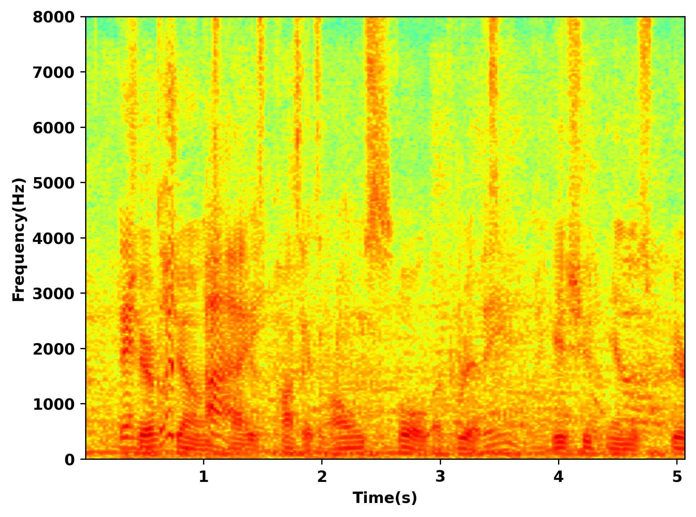</td>
                    <td style="vertical-align: middle; text-align: center; padding: 10px 5px 0 5px;">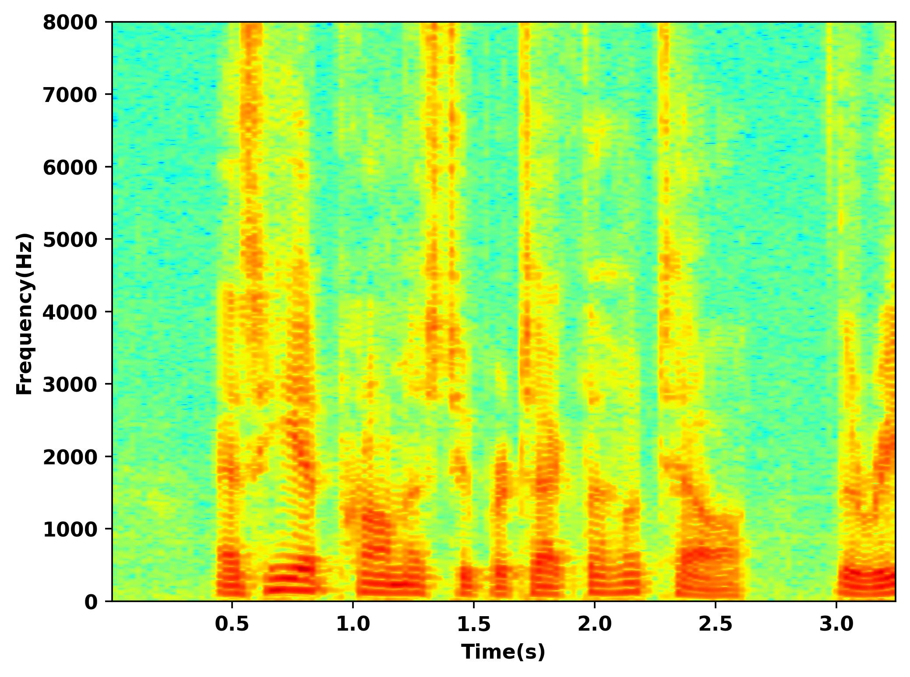</td>
                    <td style="vertical-align: middle; text-align: center; padding: 10px 5px 0 5px;">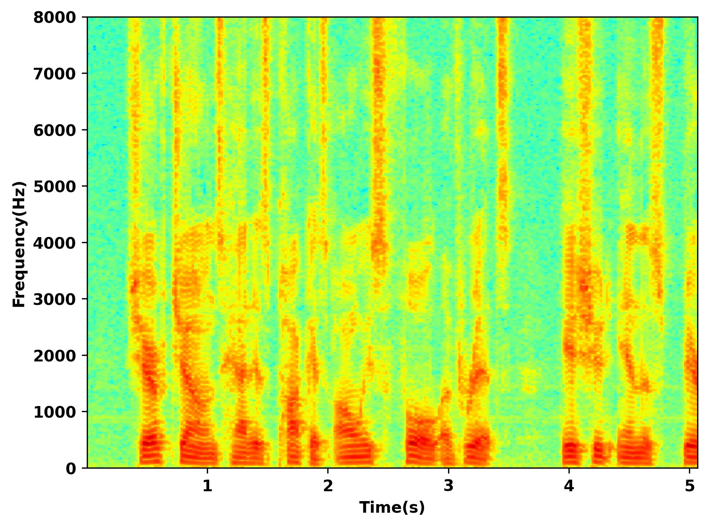</td>
                    <td style="vertical-align: middle; text-align: center; padding: 10px 5px 0 5px;">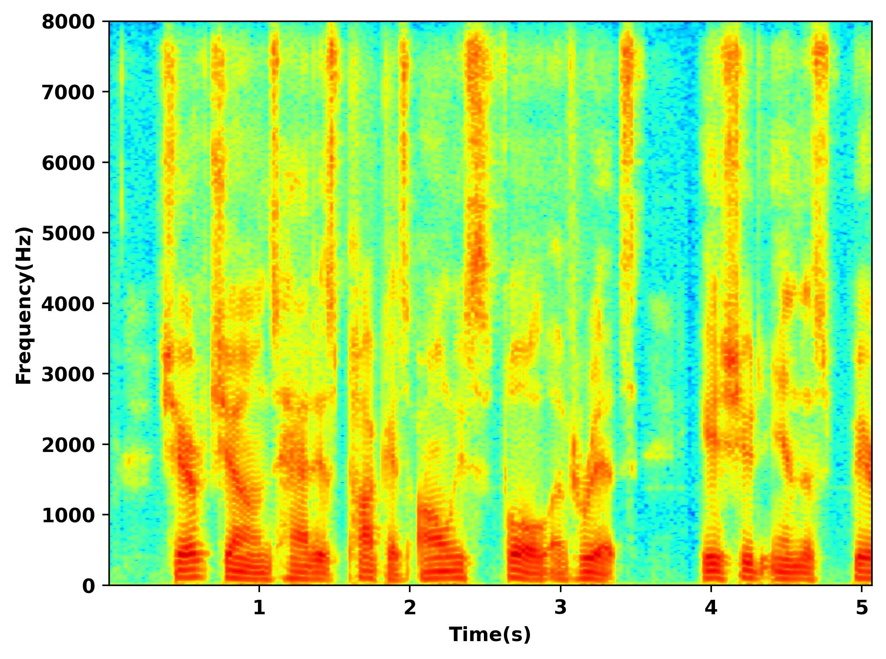</td>
                    <td style="vertical-align: middle; text-align: center; padding: 10px 5px 0 5px;">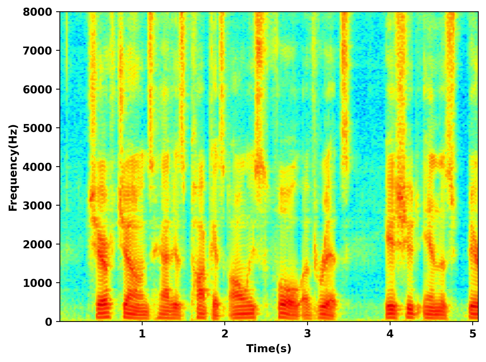</td>
                    <td style="vertical-align: middle; text-align: center; padding: 10px 5px 0 5px;"></td>
                </tr>
                <tr>
                    <td style="vertical-align: middle; text-align: center; padding: 0 5px 10px 5px;"><audio controls style="width: 100%;"><source src="audio/Libri2Mix-Noisy/MM/7729-102255-0017_672-122797-0063/Mixture.wav" type="audio/wav"></audio></td>
                    <td style="vertical-align: middle; text-align: center; padding: 0 5px 10px 5px;"><audio controls style="width: 100%;"><source src="audio/Libri2Mix-Noisy/MM/7729-102255-0017_672-122797-0063/Enroll1.wav" type="audio/wav"></audio></td>
                    <td style="vertical-align: middle; text-align: center; padding: 0 5px 10px 5px;"><audio controls style="width: 100%;"><source src="audio/Libri2Mix-Noisy/MM/7729-102255-0017_672-122797-0063/S1_Clean.wav" type="audio/wav"></audio></td>
                    <td style="vertical-align: middle; text-align: center; padding: 0 5px 10px 5px;"><audio controls style="width: 100%;"><source src="audio/Libri2Mix-Noisy/MM/7729-102255-0017_672-122797-0063/S1_MaskGENet.wav" type="audio/wav"></audio></td>
                    <td style="vertical-align: middle; text-align: center; padding: 0 5px 10px 5px;"><audio controls style="width: 100%;"><source src="audio/Libri2Mix-Noisy/MM/7729-102255-0017_672-122797-0063/S1_CIENet256.wav" type="audio/wav"></audio></td>
                    <td style="vertical-align: middle; text-align: center; padding: 0 5px 10px 5px;"><audio controls style="width: 100%;"><source src="audio/Libri2Mix-Noisy/MM/7729-102255-0017_672-122797-0063/S1_SpEx+.wav" type="audio/wav"></audio></td>
                </tr>
                <tr>
                    <td style="vertical-align: middle; text-align: center;" rowspan="2">MM</td>
                    <td style="vertical-align: middle; text-align: center; padding: 10px 5px 0 5px;">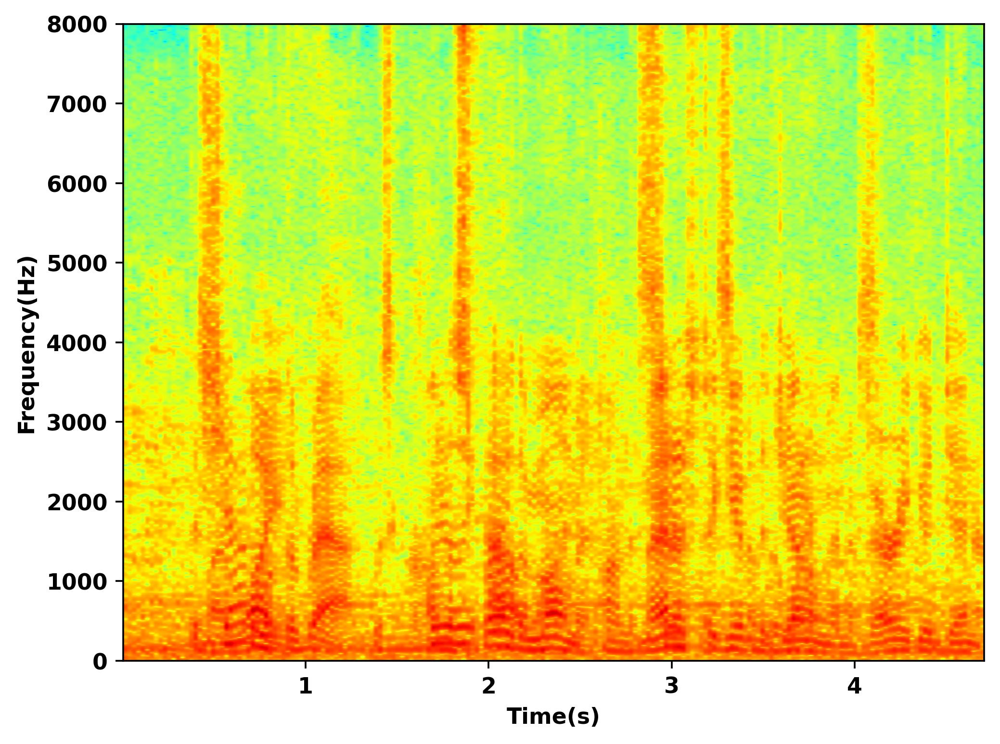</td>
                    <td style="vertical-align: middle; text-align: center; padding: 10px 5px 0 5px;">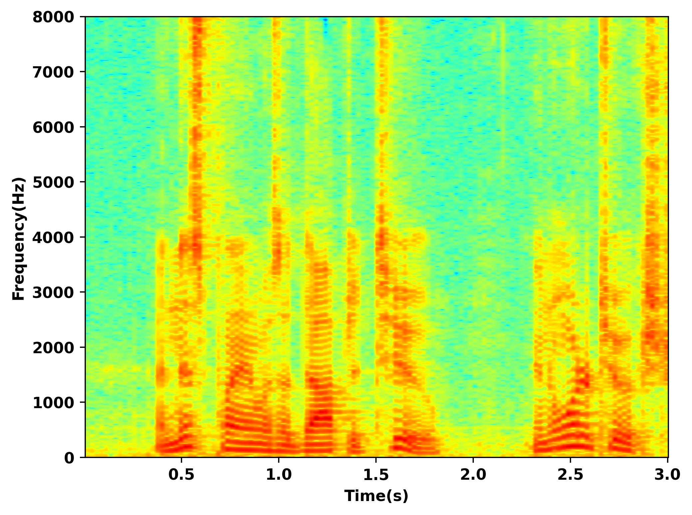</td>
                    <td style="vertical-align: middle; text-align: center; padding: 10px 5px 0 5px;">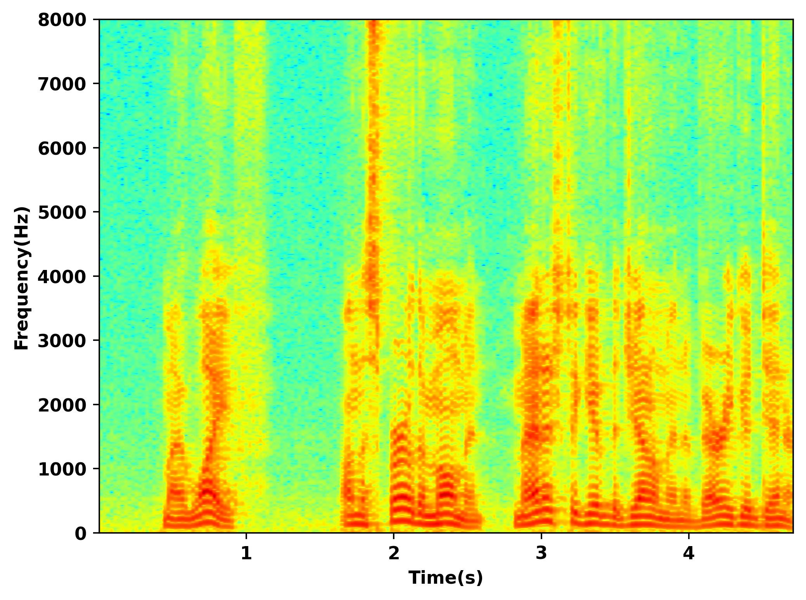</td>
                    <td style="vertical-align: middle; text-align: center; padding: 10px 5px 0 5px;">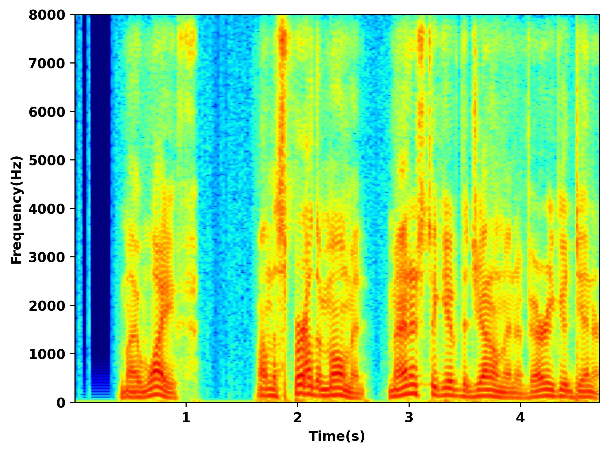</td>
                    <td style="vertical-align: middle; text-align: center; padding: 10px 5px 0 5px;">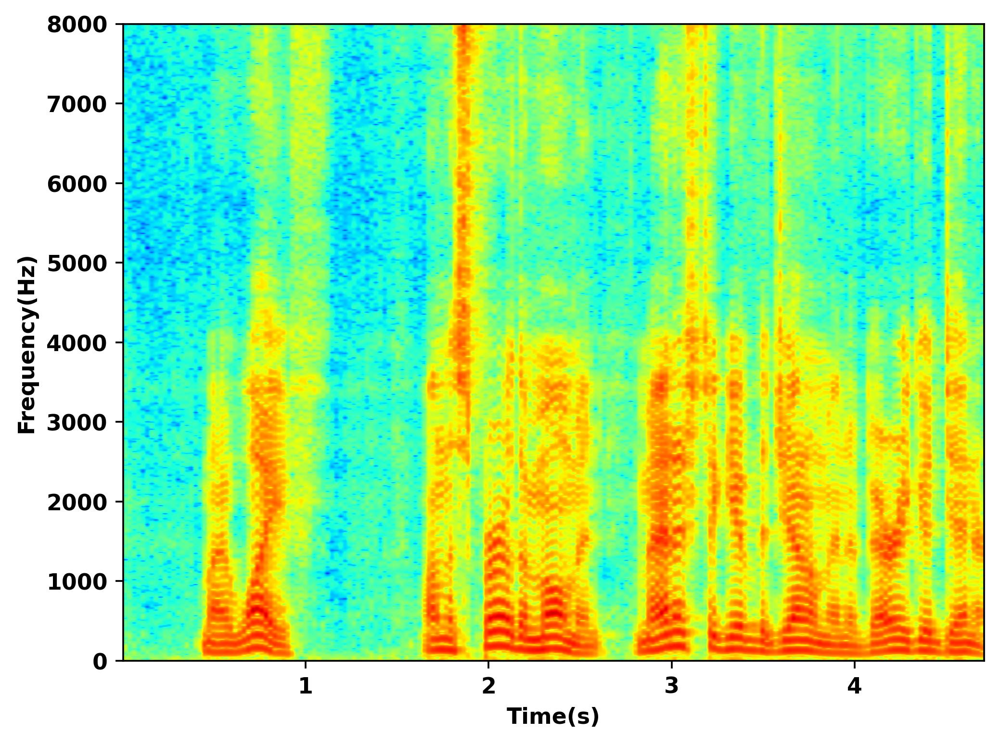</td>
                    <td style="vertical-align: middle; text-align: center; padding: 10px 5px 0 5px;">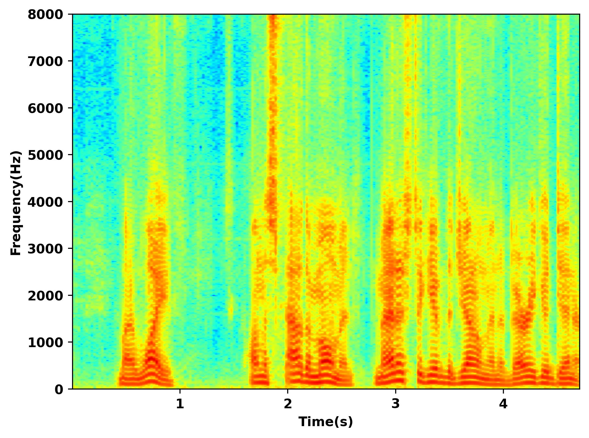</td>
                </tr>
                 <tr>
                    <td style="vertical-align: middle; text-align: center; padding: 0 5px 10px 5px;"><audio controls style="width: 100%;"><source src="audio/Libri2Mix-Noisy/MM/8455-210777-0017_260-123286-0013/Mixture.wav" type="audio/wav"></audio></td>
                    <td style="vertical-align: middle; text-align: center; padding: 0 5px 10px 5px;"><audio controls style="width: 100%;"><source src="audio/Libri2Mix-Noisy/MM/8455-210777-0017_260-123286-0013/Enroll1.wav" type="audio/wav"></audio></td>
                    <td style="vertical-align: middle; text-align: center; padding: 0 5px 10px 5px;"><audio controls style="width: 100%;"><source src="audio/Libri2Mix-Noisy/MM/8455-210777-0017_260-123286-0013/S1_Clean.wav" type="audio/wav"></audio></td>
                    <td style="vertical-align: middle; text-align: center; padding: 0 5px 10px 5px;"><audio controls style="width: 100%;"><source src="audio/Libri2Mix-Noisy/MM/8455-210777-0017_260-123286-0013/S1_MaskGENet.wav" type="audio/wav"></audio></td>
                    <td style="vertical-align: middle; text-align: center; padding: 0 5px 10px 5px;"><audio controls style="width: 100%;"><source src="audio/Libri2Mix-Noisy/MM/8455-210777-0017_260-123286-0013/S1_CIENet256.wav" type="audio/wav"></audio></td>
                    <td style="vertical-align: middle; text-align: center; padding: 0 5px 10px 5px;"><audio controls style="width: 100%;"><source src="audio/Libri2Mix-Noisy/MM/8455-210777-0017_260-123286-0013/S1_SpEx+.wav" type="audio/wav"></audio></td>
                </tr>
            </tbody>
        </table>
    

